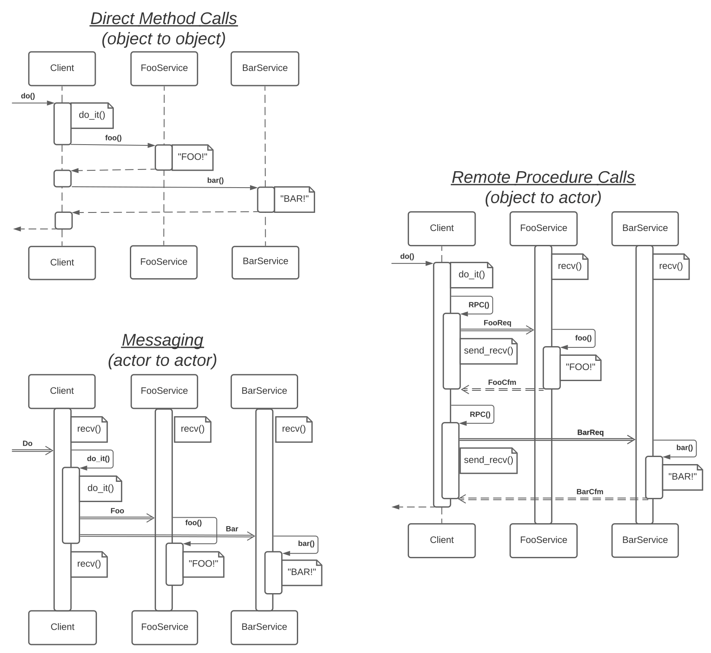
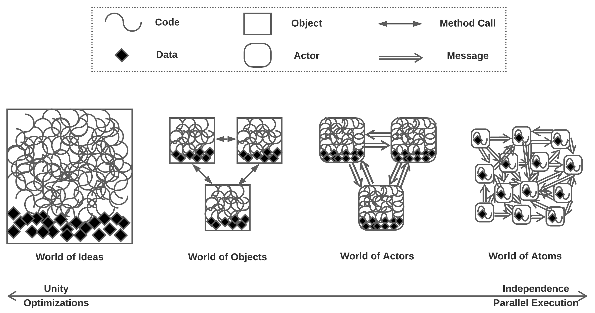
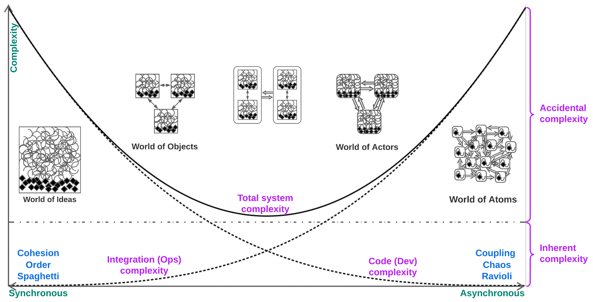

_[Part](../README.md)_ **1** 2 3 4 5

# Introduction to Software Architecture with Actors: Part 1 – On Complexity

_Actors_ have been known for quite a while ([1973](https://en.wikipedia.org/wiki/Actor_model)) and have seen wide use in real-time (embedded, telecom, and gamedev) systems. Moreover, modern event-driven architectures fit the definition of actor systems, indicating that actors appear to have been (recently) reinvented. It even seems that OOP was [originally defined](https://youtu.be/bo5WL5IQAd0?t=2472) through [objects interacting via events](https://en.wikipedia.org/wiki/Simula#Simulation), which made these early objects behave like actors. With the wider industrial adaptation of objects, people found that it was far easier to write business logic as a series of synchronous method calls rather than use message passing, redefining the concept of an object and forgetting about actors until distributed systems became mainstream.

The modern literature on distributed architectures deals with testing pyramids, fault tolerance, and the selection of middleware and databases, as well as other important nuances of practicality. However, the very basic idea that the structure of a system defines its properties and applicability was mostly lost amidst the details of implementation. In the quest to regain it, actors may serve as an intuitive model with a single type of interaction. All the extraneous details are thereby discarded; the properties of an actor system don’t depend to any great degree on whether the actors belong to a single process or are spread over multiple servers.

##### Table of Contents
- [What is an Actor](#what-is-an-actor)
  - [Actors vs Objects](#actors-vs-objects)
- [Types of Systems](#types-of-systems)
- [Complexity](#complexity)
  - [Dev / Ops](#dev--ops)
  - [Order / Chaos](#order--chaos)
  - [Inherent / Accidental](#inherent--accidental)
  - [Coupling / Cohesion](#coupling--cohesion)
- [Distributability](#distributability)
  - [When to Distribute](#when-to-distribute)
- [Variations of Actors](#variations-of-actors)
  - [Threading](#threading)
  - [State](#state)
  - [Miscellaneous](#miscellaneous)
- [Summary](#summary)
- [References](#references)

## What is an Actor?
An _actor_ is an entity consisting of _behavior_ (code) and _state_ (data) that may interact with similar entities _exclusively_ via asynchronous message passing. At any given moment, an actor is either waiting for an incoming message (being _idle_) or processing an incoming message. Incoming messages are usually posted to a queue (_mailbox_) by senders, while a handler thread pops and processes the messages from the queue one by one. Sound familiar?

One (heretical) generalization one could make is that _every (web) service is, in essence, an actor_, for its memory cannot be directly accessed from outside the process and its only means of communication is via asynchronous IP packets.

Points of interest:
1. The state (memory) of an actor can be accessed by none but the owner actor (meaning that all the data is private).
2. An actor is a finite-state machine that reacts to incoming messages.
3. If an actor is single-threaded and does not call nondeterministic functions (provided by the OS or libraries), its behavior is deterministic (an actor in a defined initial state will always produce identical sequences of outgoing messages when provided with identical sequences of incoming messages), allowing _event sourcing_ [[MP](#MP), [DDIA](#DDIA)] and [the replay of bugs and crashes](http://ithare.com/chapter-vc-modular-architecture-client-side-on-debugging-distributed-systems-deterministic-logic-and-finite-state-machines/) under a debugger once events in the system have been logged.
4. As a classic actor never processes more than a single message at a time (ordinary actors are single-threaded), keeps its data private, and cannot access the data of other actors, the code of actors does not need to deal with thread synchronization, except for the single mutex + condition variable pair that protects the message queue. However, the code of the message queue is either provided by a framework or implemented once and never needs to be changed, and thus does not complicate the business logic with mutexes.
5. As the code in actors never needs to synchronize (except for the very short duration required to pop incoming or post outgoing messages and the synchronization that takes place inside the system memory manager), actors are able to efficiently use 100% of the CPUs available.
6. Actors are very similar to objects. They differ primarily in access mode, in that objects have synchronous interfaces while those of actors are asynchronous. The consequence of this asynchronicity is that any logic relying on the states of several actors tends to be extremely ugly. Because inter-actor messages are of a fire-and-forget kind, there is no way for an actor to send a request to another actor, block, and receive a response in the same method. If a response ever comes, it may appear after some other random messages coming from unrelated use cases that have meanwhile gotten into the actor’s message queue. This makes logic that is spread over several actors very complex to write and hard to debug, and thus generally undesirable.
7. On the other hand, a single actor may contain any amount of code, even to the extent of wrapping the whole business logic of the application in a single actor. There is one common requirement, though: any request should be quick to process so that the actor never blocks and is always ready for more incoming events. This also means it is possible to wrap objects with actors (and, conversely, to provide synchronous object interfaces for actors: _Active Object_ [[POSA2](#POSA2)]).

Some programming languages (such as Go) provide out-of-the-box support for message channels, while others allow sending messages to actors by name or by reference. These approaches [are mostly similar](https://homepages.inf.ed.ac.uk/slindley/papers/acca.pdf), with message channels granting finer control akin to prioritized message queues. Moreover, actors can be easily implemented in generic programming languages, e.g. C, Python or Java, as a thin layer on top of a basic threading library (_e.g._ pthread). Message passing may use _Publish-Subscribe_ [[EIP](#EIP)] (though with some reservations as pub/sub implements [agents](https://wiki.c2.com/?ActorVsAgent)), employ _Message Bus / Event Bus_ [[EIP](#EIP)], or post messages directly to the recipient’s message queue. Another possible approach (a special case of pub/sub bus) is for each actor to subscribe to a range of message ids; in such systems, when an actor sends a message, it does not specify the destination or channel; instead, the runtime dispatches the message to an actor responsible for handling this type of message. 

Actors may share address space (running in the same process), hardware (running on the same computer) or be distributed over a network. A shared address space allows for tree-like structures to be sent in messages without any extra effort and guarantees that the whole system is stopped if one of the components crashes. A system of actors may use Request-Confirm message pairs, rely on Notifications, or involve a mixture of the message types.

### Actors vs Objects

<table>
  <tr>
   <td>
   </td>
   <td><strong>Objects</strong>
   </td>
   <td><strong>Actors</strong>
   </td>
  </tr>
  <tr>
   <td><em>Interface</em>
   </td>
   <td>Synchronous (method call)
   </td>
   <td>Asynchronous (message passing)
   </td>
  </tr>
  <tr>
   <td><em>Execution in the system</em>
   </td>
   <td>Sequential
   </td>
   <td>Concurrent
   </td>
  </tr>
  <tr>
   <td><em>The system is deterministic</em>
   </td>
   <td>Yes, if single-threaded
   </td>
   <td>No
   </td>
  </tr>
  <tr>
   <td><em>Encapsulation</em>
   </td>
   <td>Partial (public data) or complete (private data)
   </td>
   <td>Complete (with only the message queue exposed)
   </td>
  </tr>
  <tr>
   <td><em>Polymorphism</em>
   </td>
   <td>Yes, via inheritance or interface implementation (static typing) or equal method names (duck typing)
   </td>
   <td>Yes, if they handle the same types of messages (for none is ever aware what’s inside an actor)
   </td>
  </tr>
  <tr>
   <td><em>Inheritance of implementation</em>
   </td>
   <td>Often used
   </td>
   <td>Rarely used, but possible
   </td>
  </tr>
  <tr>
   <td><em>Cloning (copying)</em>
   </td>
   <td>Sometimes
   </td>
   <td>Sometimes
   </td>
  </tr>
</table>

When interacting, objects _call_ objects synchronously (like a phone call or face-to-face talk in real life) – they reside in the same thread of execution. Actors, on the other hand, live in independent threads and _send_ each other asynchronous notifications (akin to SMSes or emails). As per usual, there is a middle ground: a _Remote Procedure Call_ is where an object sends a request message to an actor and waits for the actor’s response message (analogous to the operation performed in instant messengers). The benefit of an RPC is that the programming _inside the calling object_ is as simple as it would be with ordinary synchronous calls. However, this type of messaging also makes the system slower, and waiting for a message causes everything to hang in cases where the target actor crashes. Thus, the mixed case is a compromise, one of many that will appear in the following parts of this cycle.

The diagram shows that:
1. Direct calls (objects) belong to a single thread, and the entire use case looks simpler than it does when implemented in other paradigms.
2. With message passing (actors), the client thread becomes ready for new use cases faster than it does with other approaches, as the code never blocks on external modules.
3. With message passing (actors), the services do their tasks simultaneously.
4. RPCs do not have any of the benefits listed above; instead, it is the longest and most complex use case.

Both objects and actors are _modules_ (or what used to be called _services_). Thus, a natural question to ask is: Which type of module is preferable for system decomposition: objects or actors? Or is it better to mix together synchronous and asynchronous interfaces, as is often found with modern microservices?

Objects have long been (and now are, for simple systems) the default solution; they are easy to debug, as the system is synchronous and, if single-threaded, deterministic (replayable). Nevertheless, there are some cases where asynchronous actors are preferable:
1. When several tasks should run in parallel to make sure that the system is able to respond to simultaneous external events, or that it is able to benefit from multiple CPU cores. The use of multithreading with objects negates the simplicity of development with the object model, while synchronization tends to inhibit efficient CPU utilization.
2. When the system is shaped by opposing _forces_ [[MP](#MP)] (non-functional requirements). For example, it needs to both process huge files / run long calculations and handle interrupts / play animations. It is possible to poll for interrupts (or check the system time to render the animation frames) at some points of a long calculation’s loop, but such a single-threaded approach will interleave and make the code implementing both tasks (long calculation and real-time animation) ugly. It is much more convenient to split the tasks that are formed by conflicting forces (e.g., a long task vs a periodic real-time task) into subsystems that work independently – actors. In that case, the calculation will run in a background thread while the animation uses a higher priority foreground thread that wakes up (possibly interrupting the background calculation on a single-core CPU) when yet another frame needs to be rendered.
3. When there is a need for very fast reactions to external events, which is an unlikely achievement with large synchronized code bases (monoliths) or
4. When the ease of development and deployment is desirable for a _relatively independent_ piece of code (subdomain, module, name your own) that belongs to a large project (monolith).
5. When we want to make sure that no other team will ever be able to hack into our data by bypassing our interface. As an actor cannot reach another actor’s data, everything goes through interfaces, even when a nervous PM is late for his deadline.
6. When the system does not fit on a single server (CPU, RAM or HDD limitations).
7. When the codebase is so huge that nobody understands it. It calls for a [piecemeal rewrite](http://www.hillside.net/plop/2020/papers/yoder.pdf), this time with a kind of protection from high coupling (see clause 5 above).

All the listed cases call for the division of the system by asynchronous interfaces and possibly also the distribution of the resulting actors (asynchronous modules) over multiple servers if the system’s resource consumption ever goes over the single server’s limit. As soon as there are asynchronous interfaces and no modules intend on using them in a synchronous way (RPC), the system is already halfway to achieving distribution over multiple servers.

## Types of Systems
Let’s outline an ideal project. It features ideal code which is ideally composed and even more ideally optimized during compilation. All the data fits in a perfectly flat structure, and everything works in a perfectly correct way. This describes the **world of ideas**, also known as _spaghetti_, functional or procedural programming.

When such a world clashes with real business requirements, the project becomes less ideal and _much_ larger. The architects start having difficulties with comprehending all the interactions in the domain and thus with inducing the single true architecture for the project. It reminds me of a story from ancient times, when the grass was greener, and the future author of _The Timeless Way of Building_ had just started learning Taoism. There was a team of architects assigned to design an enterprise-scale system. For a while, they were trying all the known approaches, but every attempt failed to produce anything reasonable to meet such an insanely complex challenge. Therefore, the architects came to the conclusion that there was no other way to proceed but to expand their consciousness. They booked a room overnight with a blackboard, chalk, and some acid. Thus enlightened, they managed to cover the entire blackboard with every detail of the truly ideal enterprise architecture they’d envisioned. However, as soon as the morning light dispelled the unutterable spirit that had temporarily possessed them, they found the board so saturated with information that none of them could comprehend the entirety of the design inscribed.

These very moments of enlightenment make people consider the concept of modularity. Both code and data are clusterized into minimally-interacting subdomains, which are easier to comprehend in isolation. This is called **modularity**, also referred to as _OOP_. 

But cruel reality strikes again with _non-functional requirements_, making modularity meet the same fate as the earlier attempts to comprehend the domain as a whole. It just appears that sundry modules are expected to exhibit diverse properties, and any attempts to tie such different things with synchronous calls make absolutely zero sense. Yielding to the unbearable force of the application’s non-functional requirements, the modules turn asynchronous and independent. Enter **actors** or (micro-)services.

In the unlucky case that an architect becomes overly enthusiastic and transgresses the Tao, there is a further step into the brave new world of **ravioli** (aka atoms or nanoservices) that lacks synchronous interactions. It resembles physical reality; all interactions are notifications.

> _As a side note, a well written monolith has better throughput (computing efficiency per CPU core), while actors allow for better responsiveness (easy coding for real-time actions)._

## Complexity

**Complexity** can be described as the measure of how hard it is to change a system in a desired way (such as adding a new feature or bugfix) without introducing unexpected behavioral changes (i.e. bugs). Generally, as a domain model grows, its complexity increases superlinearly, which means that for any limited cognitive abilities, there is some humble project size that comprises the comfort zone in terms of providing development or support. Any attempts to force one’s way out of that zone have a very high risk of introducing random effects (bugs), causing burnout, and are [sure to take a crazy amount of time](https://goomics.net/374/) (See _monolithic hell_ in [[MP](#MP)]). There are several views on the nature of complexity:

### Dev / Ops

1. **Code (_Dev_) complexity** (_[spaghetti](https://wiki.c2.com/?SpaghettiCode)_ – the mess inside a module): the behavior of some code that defines a given functionality depends on other snippets of code which define other, sometimes related, functionalities and may recursively depend on even more code elsewhere. As a matter of fact, understanding an instance of local logic requires comprehending much of the project’s code. _It’s like an epic novel with hundreds of well-developed characters, where one must read vast portions of the book to find out why the characters behave as they do._
2. **Integration (_Ops_) complexity** (_[ravioli](https://wiki.c2.com/?RavioliCode)_ – the mess of many modules): the correctness of a given module’s behavior (which implements a part of a project’s functionality) requires a definite environment consisting of other properly configured modules and interconnections in the system. Those other modules may recursively have more environmental dependencies to work correctly; thus, making the right changes in a module’s interface and behavior depends on one’s understanding of interactions throughout the entire system. _To continue the literary parallel, integration complexity is reminiscent of scientific articles that are impossible to understand without reading all the papers referenced, which in turn make one look through whatever sources those papers drew on._

**Total complexity** is the sum of the two (_Dev_ + _Ops_) complexities.

It is often possible to redistribute complexity between its various types. If a project starts as a monoblock, the introduction of modularity prevents overwhelming interdependency: the code and data are split among modules separated by (hopefully narrow) interfaces, weakening the dependency of the code inside a module on the code inside other components. In ideal cases, it should be enough to see any component’s code, interface and contract to understand how it works. However, splitting an initially monotonic application into modules creates a new kind of complexity, namely the integration of those modules (Can we understand the behavior of the system by looking at its structure? Is the structure not clear enough?). The more evenly the project’s complexity is distributed between the code inside its modules and the integration of those modules, the easier development is going to be, and the larger, in terms of total domain complexity, the project we can efficiently maintain.

Uncle Bob recommended having no more than 10 actions per method in the code. This addressed code complexity (spaghetti) by moving most of the complexity to the integration levels (ravioli). This way, a project with millions of lines of code will have hundreds of thousands of methods, paralyzing any programmer, whether these methods are bunched into 10 classes with 10 000 methods each (_God Objects_) or evenly distributed among 10 000 classes with 10 methods per class (ravioli code). The application of Uncle Bob’s rule did not improve programming experience – instead, it made it impossible to maintain a project. The best case would have been to have 100 classes, with 100 methods per class and 100 actions per method to keep the complexity at every level of the code in control. Thus, as a project grows, it usually makes sense to simultaneously and evenly increase the length of the methods, the number of methods per class, the number of classes per module, the number of modules per service, and the number of services in the system. Such an approach balances complexity among all the levels of the system.

### Order / Chaos

Systems from the _World of Ideas_ (**_order_**) are perfectly optimized but extremely fragile; it is impossible for an average mind to comprehend one or make local changes without shattering the whole thing.

Systems from the _World of Atoms_ (**_chaos_**) are unruly and uncontrollable – they will do anything except what they are expected to do. And yes, they are _very_ flexible – even to the extent that every single run produces different results.

The _comfort zone_ for human activities belongs to the middle ground, where there are both some rules to control the system (make it predictable) and some flexibility to evolve it over time.

### Inherent / Accidental

Imagine a graph. It can be plotted from different perspectives. If we run a clusterization algorithm on it, we are likely to recognize its structure. Otherwise, it appears as a random mess of intersecting lines.

The clusterized picture is **_inherent_** complexity – the graph cannot be drawn any more simply than that.

The original, seemingly random representation also bears **_accidental_** complexity – the graph is not drawn as its most understandable representation.

When applied to software, there is always _inherent_ complexity in the target domain (requirements), but poorly structured software also bears too much accidental complexity. It seems that humans consider both monoblock (without borders) and fine-grained (with too many borders) systems poorly structured, thus having high _accidental_ complexity. It is also noteworthy that achieving a system with exclusively _inherent_ complexity (and zero _accidental_ complexity) is extremely unlikely. One can only try to minimize it during development and keep it in control via refactorings. It has also been stated that perfect architectures appear after two consecutive re-implementations of a system from scratch.

### Coupling / Cohesion

**_Cohesion_** is the measure of how closely code and data for the related functionality interact: how easy it is to reach from a code describing some concept to the code that works with related concepts; how compact and self-consistent the description of a module is.

**_Coupling_** describes the measure of interdependencies between modules. In tightly coupled systems, modules cannot be implemented or deployed independently – they rely on each other’s implementations.

The common wisdom is to aim for _low coupling, high cohesion_. Low coupling is achievable by introducing asynchronous interfaces, whereas high cohesion is achieved by sticking to large-grained modularity. And _“low”_ does not mean _“zero”_, which fits only single-component (highly cohesive, single file spaghetti) systems. Thus, it seems that the coupling / cohesion approach is derived from distributing complexity over different levels of code, as was described above. Coupling stands for the number of classes, while cohesion stands for the product of the number of methods per class and the number of lines of code per method. As cohesion is a second order function, it will be higher than coupling, which is a first order function, for the even distribution of the project’s complexity over actions in methods, methods in classes, and classes in the system.

Let’s compare the measures of complexity for the different kinds of systems:

It appears that large projects, where complexity hits hard, should ideally stick to the middle ground between modular OOP and asynchronous actors. This common wisdom is called **Microservices**, where synchronous OOP (modularity) controls complexity inside each service while asynchronous interfaces keep the services separate and autonomous.

## Distributability
Yet another factor adding to the success of microservice architectures in case of a thoughtful use (as _[‘Think’ is not a four-letter word](http://www.dietmar-kuehl.de/mirror/c++-faq/big-picture.html#faq-6.16)_ thinking may help elude rules (ideally – any rules; in reality – the rules that are not applicable in one’s case)) is the relative ease of distributing microservice systems as opposed to distributing modular applications over _physically_ _independent_ servers.

A **distributed system** is a system where the components involved rarely if ever have means for efficiently accessing the memory (state) of other components. Technically, there is no difference between the artificial access restriction for actors living in the same process and the intrinsic restriction for service processes residing on separate servers connected by a network. In reality, the network adds the possibility of connectivity failures, crashes and system time variation [[DDIA](#DDIA)]. Nevertheless, the properties of a distributed system do not really depend on the way its distribution is implemented, as:
1. There are multiple logically (and usually also physically) simultaneous actions in a system – every component is doing its own task.
2. The interaction of components is (often very) expensive compared to actions inside a component.
3. The synchronization of several components’ states is prohibitively expensive, meaning that under normal conditions, no component may know the _current_ state of any other component.

If the components are connected synchronously (via RPC between objects / modules), one inaccessible or hanged component is likely to make many other components halt in a domino effect, as any call to the hanged component blocks the caller and all the caller’s callers. It is likely that the call will throw a timeout exception in several seconds, but the whole system’s performance is going to degrade in any case, with a timeout propagation over the chain of dependent components likely.

In asynchronous systems (based on messaging between actors or services), dependencies between actor states are avoided (just because such dependencies are extremely hard to implement and debug). This usually results in interactions via notifications, which means that if one of the services in the system hangs or crashes, the other services are unlikely to notice the fact: the notifications sent to the inaccessible service will wait in its incoming queue till the service is rebooted and able to process the incoming notifications again. Even in cases when a healthy service has requested some data from a failed one, the healthy service should continue serving unrelated use cases while the request waiting for the data consumes only a couple KB of RAM and nearly zero CPU.

This difference in system reliability also drove the transition from synchronous modular systems to asynchronous services.

### When to Distribute
It is a must to understand what is easy and what is hard to achieve in order to get around difficulties and be able to solve problems in simple ways ([KISS](https://en.wikipedia.org/wiki/KISS_principle), [80/20 rule](https://en.wikipedia.org/wiki/Pareto_principle)).

Let’s sort interactions in a system of actors (distributed asynchronous system) by increasing implementation complexity and runtime overhead:

1. **A local handling of an incoming event / notification.** This is very fast, has no effects outside of the target actor, loads a single CPU core and does not interfere with other actors. The event may either come as a local hardware interrupt / OS callback, be taken from the actor’s event queue, or come from a signaled subscription to an external agent. This is simply the best use case for an actor. However, it does not allow actors to communicate; thus, a _system of actors_ must contain less favorable use cases.
2. **Request processing that returns a confirmation message.** This is also very fast and simple; the overhead compared to the notification case lies with building and sending the confirmation.
3. **An incoming event causes multicast notifications.** Something important has happened, thus everybody (several other actors) should hear about it. The actor that receives the important event does its part of the job (likely transforming the external event’s logic and data into an internal representation; the actor thus holds the role of _Gateway_ in microservices [[MP](#MP)], _Adapter_ in [Hexagonal Architecture](https://alistair.cockburn.us/hexagonal-architecture/), or _AntiCorruption Layer_ [[DDD](#DDD)] – See Part 4 of the series), then forwards the processed event to the interested parties (subscribers for the corresponding event type, all instances of a specific service or a hard-coded list of services involved). This use case for actors is more expensive, as the wave of notifications modifying the state of the system (by making individual actors change their states) takes more time than an individual request / confirm exchange. It should be noted that spreading a state update notification over a system of actors is identical to the process of updating _views_ in _event sourcing_ systems with eventual consistency [[DDIA](#DDIA)].
4. **Event processing chain / distributed use case** (_Saga_ [[MP](#MP)]). Enter _Choreography_ [[MP](#MP)]. An actor (_gateway_) receives a request but is not competent to decide on the right response. The request is transformed into an internal data format (_AntiCorruption Layer_ [[DDD](#DDD)], _Normalizer_ [[EIP](#EIP)], _etc_.), sometimes skipping the data the system is not interested in (_Content Filter_ [[EIP](#EIP)]) and adding useful data from the actor’s internal (RAM) or external (database) state (_Content Enricher_ [[EIP](#EIP)]). Then, the resulting high-level message is forwarded to a service responsible for the next processing step. The sequence may repeat till one of the actors / services involved takes final responsibility for the use case and sends a response back over the chain. The use of many asynchronous steps, while the actors involved may be under load from other tasks, results in slower response times. However, this approach is still practical, as a single agent encapsulates the business logic for the final decision. \
_Variant_: The actor that makes the decision multicasts a notification about the resulting change in the system’s state. The gateway may be subscribed to such notifications and use them to build responses to external parties (the system’s clients). Such a flow features a cycle in the request processing graph.
5. **A business logic decision in an actor/service requires information from (read access to) the states of other actors/services.** There is no entity more competent with the use case decision than the current actor, but it still lacks some information. To collect the data needed to make the decision, it has to store the original customer’s request, send read requests to the other actors involved, store the asynchronous responses and merge the collected information. This bears a great resemblance to a _distributed join_ or the creation of _views_ [[DDIA](#DDIA)]. The case is complicated by the fact that our _join_ (collected data) may involve _views_ (subsets of a single actor’s state) belonging to incompatible system state _snapshots_ [[DDIA](#DDIA)], as various use cases that change the system state may be running in parallel and the state changes for actors are not synchronized (It takes time for the all the actors in the system to integrate a given change in the system’s state – the system state is _eventually consistent_). Another downside is that the speed and stability of the use case will be worse than those of the slowest and the most unstable participants, respectively. It also involves copying extra data over the system and requires some code and RAM for managing the intermediate results. \
_Conclusion_: This case looks much like a **red flag**. At the very least, some of the new requirements violate the original understanding of the domain that the system architecture was based on, as there are obviously wrong subdomain borders the decision making needs to traverse (The system is _tightly coupled_). This causes a very complex asynchronous code to get the data that would have been available via a couple of ordinary method calls had the system been written as a monolith. At most, the architect(s) wanted to [try microservices](https://martinfowler.com/bliki/MonolithFirst.html) and reached the point of no return (as the subdomains/services became too granular to be practical). \
_The ways out_: (1) Merge the troublesome subdomains into a synchronous monolith-like service / a larger actor. (2) Follow event sourcing [[DDIA](#DDIA)] to have the views of all the involved actors’ data inside the actor that makes the decision, thus removing the need for the asynchronous read calls between the actors. (3) _Choreography_ or _Orchestration_ [[MP](#MP)] may be of some help if used for appending to the request all the required data from multiple services, as the request is made to traverse all the services involved before it gets to the destination service that features the business logic and sends a response. However, this only somewhat alleviates the complexity of the use case’s implementation, not its slowness or instability.
6. **Handling a request must synchronize the states of several services**. Any delay (temporal inconsistency) between changes in several actors’ states may occasionally break a system invariant, causing the system to make incorrect decisions / produce incorrect results. \
_Or_: There is a need to simultaneously edit (read-modify-write) the data of several components, and any external changes to the data being edited are not allowed because of possible conflicts. \
_[Congratulations](https://www.youtube.com/watch?v=oyFQVZ2h0V8)_ (**[R.I.P.](https://www.youtube.com/watch?v=GiNZyIBkiCQ)**): This is a distributed transaction [[DDIA](#DDIA)] (_Good luck achieving a group decision via SMSes_). It contradicts the loose coupling prerequisite for asynchronous architectures (including actors). The system is very likely a distributed monolith [[MP](#MP)] (See Part 5 of this series). In theory, every single case of a distributed transaction may be resolved by adding yet another orchestrator [[MP](#MP)] and a couple of technical support employees to manually resolve the resulting conflicts / clean stale lock flags, but it is extremely likely that the asynchronous parts the domain has been split into are too small [[SAP](#SAP)], and that now it’s high time to either [rewrite everything from scratch](http://blogs.newardassociates.com/blog/2023/you-want-modules-not-microservices.html) or look for a new job. \
_Except_: Enterprise services developed by hundreds of programmers. In that case, any way of splitting the domain, even by dividing tightly coupled modules, is much better than letting everyone deal with the whole thing (_monolithic hell_ [[MP](#MP)]). Nevertheless, this does not mean it’s not the time to start looking for a new job.

## Variations of Actors
The notion of actors is simple and stupid enough to produce many variations, the most common of which are listed below:

### Threading

1. **Vanilla actors** (implementable in any language that supports multithreading or even with Unix pipes). Every actor resides in a dedicated thread or process scheduled by the OS. The scheduling is tunable by setting real-time thread priorities. \
_Benefit_: The simplicity of implementation.
2. **Shared thread pool, aka [fibers](https://en.wikipedia.org/wiki/Cooperative_multitasking)** (Erlang/Elixir out of the box; implementable in C/C++). A thread for every CPU core is created and pinned (with processor affinity) to be used by a custom scheduler which iterates over all the system actors and runs any actor with a non-empty message queue in one of the pooled threads. Prioritizing actors is achievable by sorting the list of ready-to-run actors by some priority parameter. \
_Benefits_: (1) The lack of kernel mode rescheduling per message, as the user mode threads are able to process multiple messages for multiple actors without ever entering kernel mode. (2) The actors are extremely lightweight (having state variables + a (usually empty) message queue), as they don’t own threads. Millions of them can be spawned, though one is unlikely to really need that.
3. **Shared thread pool with time quotes** (Erlang/Elixir). The scheduler does not always wait for actors to finish processing messages; instead, it may store the slow actor’s stack, decrease its priority, and yield the execution thread to other actors. Thus, the user mode scheduler takes on the full functionality of the OS scheduler. \
_Benefit_: Slow or hanged actors cannot deplete the system’s CPU resources. \
_Drawback_: Rescheduled actors do use RAM for call stacks (and therefore are not that lightweight).
4. **Multithreaded actors** (usually, (micro-)services). If an actor is stateful, the simplicity and efficiency of its code has been sacrificed (by introducing mutexes) to allow the actor to simultaneously process multiple requests. This is commonly found with _Reactor_ [[POSA2](#POSA2)] (Part 2 of this series) services that access databases or other services in synchronous ways. \
_Benefits_: (1) One service instance can process several requests in parallel. (2) One service instance can use multiple CPU cores. (3) As a result, blocking calls during the request processing don’t degrade the overall performance too much. (4) Synchronous (blocking) code is usually much simpler than its asynchronous counterpart. \
_Drawbacks_: (1) Performance degradation caused by synchronization on accessing the actor’s state. (2) High RAM consumption from thread stacks. (3) Indeterminism, thus [sacrificing event replay](http://ithare.com/multi-threading-at-business-logic-level-is-considered-harmful/). \
_The way out_: Rewriting the service in [coroutines](http://ithare.com/multi-coring-and-non-blocking-instead-of-multi-threading-with-a-script/) (see below) is possible if the service is not CPU-limited and the team has time for coding the async coroutines infrastructure.
5. **Actors with [coroutines](http://ithare.com/multi-coring-and-non-blocking-instead-of-multi-threading-with-a-script/2/)**. The actor consists of two halves: high-level synchronous use cases serve multiple requests with the help of an asynchronous event handling engine (_Half-Sync/Half-Async_ [[POSA2](#POSA2)], Part 2 of this series). This is a lightweight option compared to resource-intensive multithreaded _Reactors_ [[POSA2](#POSA2)] (also detailed in Part 2). The coroutines engine here is roughly equivalent to an RPC engine (both translate synchronous calls into asynchronous requests). \
_Benefit_: Synchronous processing of multiple simultaneous requests without sacrificing determinism (or event replay). \
_Drawbacks_: (1) Complex infrastructure. (2) Limited to a single CPU core, or needs to sacrifice determinism and introduce mutexes. (3) Somewhat higher RAM consumption (for coroutine stacks) when compared to the implementation with fibers.

### State

1. **Every actor stores its state in RAM** (the default implementation).
2. **Serializable actors** (Akka, implementable in C/C++). The states of actors are dumped to a drive or network; thus, actors become restorable after crashes and can be [unloaded from memory](http://ithare.com/multi-coring-and-non-blocking-instead-of-multi-threading-with-a-script/3/). Yet another name for _event sourcing_ [[DDIA](#DDIA)].
3. **Distributed actors** (Erlang/Elixir, Akka). Runtime transparently optimizes actor placement over a server pool, moves actors away from overloaded machines and restores crashed actors. \
_Drawbacks_: (1) There are magic config files. (2) System responsiveness may suffer while the runtime moves actors around.
4. **Stateless actors** (CGI/fCGI/FaaS). Just a piece of code with an interface that receives everything needed for request processing from the request itself or by calling other services. Such actors may be spawned in large quantities without any concern for synchronization.

### Miscellaneous

1. **Blocking actors** (_Reactor_ [[POSA2](#POSA2)], Part 2). The actor’s thread gets a request, does some blocking operations, sends a response, and only then is able to process a new request. Though often used in multithreaded mode as a naive service implementation, the single-threaded variation has its own place: a blocking _Reactor_ is the natural synchronizing wrapper/proxy/adapter for a singleton / hardware device (HDD, SPI, even a [database writer connection with lower isolation level](http://ithare.com/multi-coring-and-non-blocking-instead-of-multi-threading-with-a-script/3/)). It is possible to emulate blocking calls in bare metal by setting a “Don’t schedule me” flag for the actor and returning from the current message handler. The flag will be cleared from inside a hardware interrupt handler as soon as the actor is done accessing the hardware.
2. **Actors with priorities** (network traffic). Incoming messages are put on one of the actor’s multiple queues (or a single prioritized queue) based on the message type, some field values, prioritizer function, whatever. The actor either starts processing a higher priority message as soon as it appears in the high priority queue (thus allowing the system to abort any slow normal priority messages) or takes the highest priority message as soon as it finishes processing its current message. Such an approach is used for prioritizing control traffic over data traffic in networking and for enforcing internet provider traffic quotes.
3. **Hierarchies of actors** (Erlang, Akka). An actor may spawn other actors at run time. The child actors will receive message channels from the parent and the system will notify the parent of the child’s crash/exception, [transfering the DevOps complexity to the main application code](https://www.erlang.org/doc/design_principles/sup_princ.html). This makes sense for [highly robust systems](https://youtu.be/cNICGEwmXLU?t=3066) containing large numbers of small actors (_Nanoservices_, see Part 3) under the [defensive programming](https://wiki.c2.com/?DefensiveProgramming) paradigm.

These variations may be combined to fit one’s needs and budget. Beware of adding too much wicked sugar to the KISS actors.

## Summary

* The cohesion-granularity dichotomy was investigated to show that systems featuring few asynchronous aggregates of synchronous modules are preferable.
* Objects and actors were compared.
* Guidelines for interactions between actors were formulated.
* Several variations of actors were described.

Next, let’s look inside an actor. To be continued…

## References

<a name="DDD"/>

[DDD] Domain-Driven Design: Tackling Complexity in the Heart of Software. _Eric Evans. Addison-Wesley (2003)._

<a name="DDIA"/>

[DDIA] Designing Data-Intensive Applications: The Big Ideas Behind Reliable, Scalable, and Maintainable Systems. _Martin Kleppmann. O’Reilly Media, Inc. (2017)._

<a name="EIP"/>

[EIP] Enterprise Integration Patterns. _Gregor Hohpe and Bobby Woolf. Addison-Wesley (2003)._

<a name="MP"/>

[MP] Microservices Patterns: With Examples in Java. _Chris Richardson. Manning Publications (2018)_.

<a name="POSA2"/>

[POSA2] Pattern-Oriented Software Architecture Volume 2: Patterns for Concurrent and Networked Objects. _Douglas C. Schmidt, Michael Stal, Hans Rohnert, Frank Buschmann. John Wiley & Sons, Inc. (2000)._

<a name="SAP"/>

[SAP] Software Architecture Patterns. _Mark Richards. O’Reilly Media, Inc. (2015)._

---

_Editor:_ [Josh Kaplan](mailto:joshkaplan66@gmail.com)

_[Part](../README.md)_ **1** 2 3 4 5

 This work is licensed under a <a rel="license" href="http://creativecommons.org/licenses/by-nc-sa/4.0/">Creative Commons Attribution-NonCommercial-ShareAlike 4.0 International License</a>.