_[Part](../README.md)_ 1 2 3 **4** 5

---

# Introduction to Software Architecture with Actors: Part 4 – On Systems with Models

The previous part of the cycle was dedicated to the basic ways of splitting a monolith by messaging interfaces:

1. Creating identical instances (**shards**) to scale the system under load, survive hardware failures, and enable synchronous outgoing calls (i.e. imperative programming  instead of reactive programming, which is the default paradigm for asynchronous systems).
  * _Precondition 1_: The data involved can be split into multiple subsets; most use cases operate on a single subset of the data.
  * _Precondition 2_: There is no shared (mutable) system state that affects the use cases.

2. Dividing into **layers** to decouple a high-level business logic from low-level platform details and allow each of the layers to run independently under a distinct set of forces.
  * _Precondition 1_: The amount of interaction between the layers (coupling) is much smaller than the amount of interaction inside each layer (cohesion).
  * _Precondition 2_: There is no shared state that directly affects several layers.

3. Dividing into **services** to isolate subdomains, mainly for getting out of _monolithic hell_ [[MP](#MP)].
  * _Precondition 1_: Most of the use cases don’t involve synchronized changes in several subdomains (though some use cases may chain through subdomains).
  * _Precondition 2_: The subdomains don’t share state.

The preconditions [may be violated](http://www.dietmar-kuehl.de/mirror/c++-faq/big-picture.html#faq-6.16) (hinted by the word “most”) at the cost of incurring slow, complicated, and unstable hackarounds (i.e. 3-phase commit, orchestration, choreography, materialized views) that are in all aspects inferior to the direct method calls used in monoliths.

It has always been **the goal of architecture** to find a combination of applicable approaches (_patterns_) that provides strong benefits and none of whose associated drawbacks (there are no benefits without drawbacks, as everything has a price) are consequential to the project’s success. It should be noted that the importance of any given set of benefits and drawbacks depends on the nature and domain of the project in question, otherwise everyone would have long since been using the same architecture and programming language.

This article investigates multiple ways of combining **layers** and **services** to see how they work together, amplifying various benefits and mitigating some of the drawbacks.

- [The Model](#the-model)
- [Π-shaped systems](#Π-shaped-systems)
  - [Hexagonal Architecture (domain model over resource services)](#hexagonal-architecture-domain-model-over-resource-services)
    - [Model-View-Controller](#model-view-controller-posa1)
  - [Gateway (system model over domain services)](#gateway-mp-system-model-over-domain-services)
  - [Application Service (domain model over domain services)](#application-service-domain-model-over-domain-services)
- [U-shaped systems](#U-shaped-systems)
  - [Middleware (domain services over a system model)](#middleware-domain-services-over-a-system-model)
  - [Shared Repository (domain services over a domain data model)](#shared-repository-posa4-domain-services-over-a-domain-data-model)
  - [Plug-ins (domain services over a domain model)](#plug-ins-sap-domain-services-over-a-domain-model)
- [H-shaped systems](#H-shaped-systems)
  - [Microkernel](#microkernel-posa1)
  - [Domain-Specific Language (DSL)](#domain-specific-language-dsl)
  - [Orchestrators](#orchestrators-mp)
- [Miscellaneous architectures](#miscellaneous-architectures)
  - [(Re)Actor-with-Extractors (Day and Night)](#reactor-with-extractors-day-and-night)
- [Summary](#summary)
- [References](#references)

## The Model
Systems with monolithic (synchronous) layers covering the whole domain are ubiquitous. Let’s call any given example of such a layer a “**_model_**”. The layer may be present at various levels of abstraction and may vary in thickness (the amount of logic): from the largest component that encapsulates all of the project’s business logic (e.g. in _Hexagonal Architecture_) to a thin layer providing connectivity (like in _Middleware_). A thick domain-wide layer may be called a “**_domain model_**”, as it contains knowledge of domain entities and, possibly, their relations. A thin layer will usually focus on a system’s components and may thus be called a “**_system model_**”. In a similar way, there are **_domain services_** (microservices, domain actors) that implement subdomain business logic and **_resource services_** that provide abstractions for (virtualize) system resources.

A model integrates information (control/data – see Part 2) flows over a system and sometimes links the data belonging to the subdomains involved; it unifies the components into a system and creates rules and means for the components to communicate.

## Π-shaped systems

Systems may feature a monolithic model with a high-level logic that relies on the help of a lower layer of services to fulfill user requests. In such cases, the domain logic (business rules) may reside in the upper layer (the model), lower layer (the set of services) or both, creating the three following patterns, respectively:

### Hexagonal Architecture (domain model over resource services)

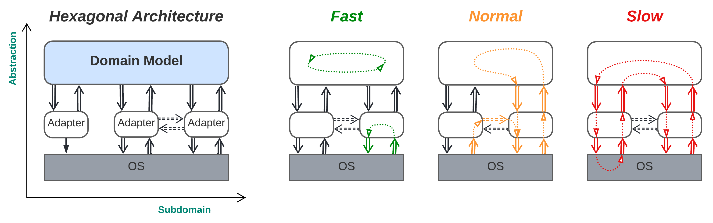

> _(Business logic is shown in blue.)_

**_Isolating the business logic from the environment._** A monolithic layer containing the entire system’s business logic (_domain model_) runs over small services (_adapters_) that encapsulate 3rd party libraries and OS interfaces. Each adapter translates the 3rd party interface of the underlying hardware, library or remote service to the _port_ (the model’s interface defined in domain terms) it serves. This structure makes the business logic module self-sufficient, as it only uses its own interfaces (_ports_) constructed in ways that are the most natural for articulating the relevant domain.

_Benefits_:
* Developing and debugging the business logic (usually about 95% of the code) is easy thanks to its monolithic structure (inherited from _Layers_), unless the project grows huge and reaches _monolithic hell_ [[MP](#MP)].
* The architecture can support use cases of any complexity unless they overuse periphery access (also inherited from _Layers_). Caching the most useful peripheral data in the _model_ helps to further improve performance.
* The _model_ (business logic) may be sharded if all the data required for calculations or decisions is included in requests (i.e. if the _model_ is _stateless_) (inherited from _Layers_).
* The _model_ (main logic) and each of the periphery adapters (or connectors) to external services have independent properties (e.g. real time responsiveness vs long calculations; implementation language; deployment frequency) (inherited from both _Layers_ and _Services_).
* The deployment of the business logic and each of the periphery adapters is highly independent (from both _Layers_ and _Services_).
* The periphery adapters run in parallel (from _Services_).
* Periphery-to-periphery communication that does not involve the main business logic layer is fast (going through direct adapter-to-adapter channels, which are optional in this architecture).
* Each of the periphery adapters, along with its underlying device or 3rd party service, is easy to replace or provide multiple implementations for, as the adapters transform the interfaces of the 3rd party components into ones suited for use with the system’s business logic (its _model_), providing protection from _vendor lock-in_ and delaying vendor selection decisions till the pre-release stage of the project’s life cycle.
* The development and testing of the main business logic may start before the components it relies on are available by using _stub_ adapter implementations.
* The resource-friendly autotesting of business logic using _stub_ adapters is supported.
* If the model is single-threaded, bugs are reproducible by recording and replaying events from the model’s message queue.

_Drawbacks_:
* _Hexagonal Architecture_ does not alleviate the project’s domain complexity (from _Layers_). The business logic is still monolithic. The use of adapter interfaces (_ports_) defined in terms that are convenient for the business logic’s domain may deal in part with the accidental complexity but cannot remedy the inherent one.
* Use cases that involve multiple peripheral devices (3rd party services) are likely to be slower and more complex with Hexagonal Architecture than with _Monolith_ (though caching may often help) (from _Services_).
* The project’s start is slowed down slightly, as all the external dependencies must either be isolated by wrapping them with adapters or be mocked with stubs.

_Evolution_:
* As the project grows, _Hexagonal Architecture_ is likely to fall into _monolithic hell_ – a state of overwhelming code complexity that is caused by having too many people working on too large a module. The only way out is to split the _domain model_ into a set of smaller _domain services_. If the domain is hierarchical (i.e. there is a single subdomain that manages or uses other subdomains), the transition to _Application Service_ (see below) or more generic _Hexagonal Hierarchy_ (described in Part 5) will be available. In rare cases of mostly linear data processing, the _domain model_ may be turned into _Pipeline_ (see Part 3). Otherwise, it should be split into _(Micro-)Services_ (from Part 3). Hierarchical decomposition is usually preferable, as it decouples the business logic along both the _abstraction_ and the _subdomain_ dimensions, resulting in a more flexible and manageable architecture.
* A need for fine-tuned customization may be solved by building _Plug-Ins_ or _Domain-Specific Language_ (both described below) on top of the _domain model_ of _Hexagonal Architecture_.
* When contradictory non-functional requirements arise, the business logic should be split just as it would be for dealing with the _monolithic hell_ described above. However, if the project is not very complex and the domain is not strongly coupled, there is the option of going for _Nanoservices_ (Part 3) and _Microkernel_ (described below).
* Scalability may be achieved by either sharding the _domain model_ or dispersing it into _Nanoservices_ over _Microkernel_, with fault tolerance as an additional benefit.

_Summary_: _Hexagonal Architecture_ brings with it many significant benefits when used for projects of a medium size and lifespan. However, small projects will be delayed by the extra effort required to code the interfaces and adapters, while huge projects will still suffer from _monolithic hell_ [[MP](#MP)] in the _domain model_ layer.

Hexagonal architecture is derived from a monolith through the following steps:
1. _Layers_ (from Part 3) are applied to split the high-level business logic from the low-level implementation details. The lower layer is called the _AntiCorruption Layer_ [[DDD](#DDD)] because it isolates the business logic from the details and changes in the integrated 3rd party components.
2. _Services_ (also from Part 3) are applied to the lower layer so that every external dependency is wrapped with a dedicated _adapter_ module, making it easy to replace or update individual 3rd party components.

The resulting architecture is both more convenient than pure _Services_ (_domain actors_) and more flexible than _Layers_, combining the benefits of both patterns. The costs are:
* There is no significant reduction in domain complexity (unlike that provided by vanilla _Services_)
* Use cases that are limited to a single business logic subdomain are somewhat slower than those within the original _Services_ pattern.

Here, a skillful combination of two basic patterns has become ubiquitous because it collected benefits that were important to many projects without possessing any critical drawbacks. In addition, it is a prominent example of outsider architecture, something which has never been featured in famous books on patterns but has nevertheless conquered the programming world.

_Software architecture_: [Ports and Adapters](https://alistair.cockburn.us/hexagonal-architecture/), [(Re)Actor-fest](http://ithare.com/multi-coring-and-non-blocking-instead-of-multi-threading-with-a-script/3/), Half-Async/Half-Async [[POSA2](#POSA2)] (_Proactor_ model), **Model-View-Controller** [[POSA1](#POSA1)] (unidirectional flow).

_System architecture_: **[Hexagonal Architecture](https://alistair.cockburn.us/hexagonal-architecture/)**, [Onion Architecture](https://herbertograca.com/2017/09/21/onion-architecture/), [Clean Architecture](https://blog.cleancoder.com/uncle-bob/2012/08/13/the-clean-architecture.html).

_The diagram does not look like Hexagonal Architecture!_ All the structural diagrams in this series are drawn in Cartesian _ASS_ coordinates (described in Part 3), whereas typical drawings for _Hexagonal Architecture_ use polar coordinates with reverse abstraction for distance and subdomain for angle:

In _control_ systems, the domain model tends to contain information about the last observed state of the system and the environment to base its decisions on. For example, in robotics, a control module should be able to synchronously access (read the cached data for) both the coordinates and velocities of all the manipulators and a 3D map of its environment to allow for the real time (in-RAM, without reading from the hardware) calculations of future actions.

In _data processing_ systems, the amount of data (the full state of the system) is usually larger than the available RAM; thus, it needs to be stored in a database wrapped with one of the adapters and be read into the model only when the data is needed to process a request. The model usually only contains the data loaded for the ongoing requests, though sometimes, it may cache frequently used objects to speed up request processing and unload the database.

Requests from the model to the adapters may be synchronous (blocking RPC), asynchronous (request/confirm or notifications), or a mixture of the two (e.g. synchronous to the database and asynchronous to the network adapters) – whichever is most convenient for the system under development based on the domain and non-functional requirements. 

If both _control flow_ and _data flow _are used (as in telecom), the model (called the _control plane_) is responsible for _setting up_ the dataflow, while the heavy data traffic (_data plane_) is handled by the adapters (or even the underlying hardware) according to the installed rules, often in a zero-copy or DMA manner. This is where direct adapter-to-adapter channels [appear](https://hillside.net/plop/2020/papers/poltorak.pdf).

A variant: 

#### Model-View-Controller [[POSA1](#POSA1)]

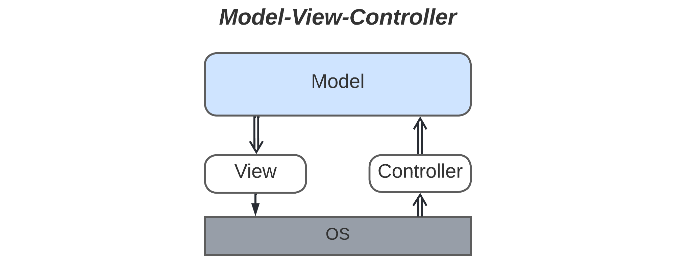

**_Isolating the business logic from the UI._** Based on its original description wherein _view_ and _controller_ were adapters for a graphical interface, _MVC_ may be considered a special case of _Hexagonal Architecture_ with a unidirectional (_pipelined_) _control_ flow.

According to [[POSA1](#POSA1)], _MVC_ separates a _model_ (logic) from a user interface in order to satisfy the following forces: 
* Support for multiple _views_ of the same _model_, while _Hexagonal Architecture_ allows for running the same business logic (_model_) in different setups (sets of _adapters_).
* The implementation of real-time change propagation to _views_, while _Hexagonal Architecture_ makes the properties (including the responsiveness) of the _model_ and the _adapters_ independent; thus, a slow _adapter_ or _model_ will not block other components.
* The option of allowing the UI to be changed without touching the main business logic, the same freedom that holds for the _adapters_ in _Hexagonal Architecture_.
* The ease of porting the UI to new platforms, which is similar to the protection from _vendor lock-in_ in _Hexagonal Architecture_.

Noticeably, the two old famous architectural patterns that feature nearly identical _ASS_ (structural – see Part 3) diagrams _serve similar goals _and_ provide similar benefits_.

The structural diagram for _MVC_ also bears a resemblance to the one for _Pipeline_ (Part 3); both feature unidirectional control flows and pairs of low-level components (_source_ and _sink_), though in _Pipeline_ architecture, the upper (business logic) layer contains multiple modules (_filters_). Thus, _Pipeline and Hexagonal Architecture are related_. If a project that was designed as a pipeline gets new requirements that make its _filters_ interdependent, or if there is a need for the ultimate optimization of performance and response time, the logic-containing _filters_ may be merged into a synchronous _model_, thus violating the original _Pipeline_ architecture and transforming it into a _Hexagonal Architecture_. Such an experience would mean that the original understanding of the project’s domain or forces (non-functional requirements) was incorrect, but, luckily, _Pipeline_ architecture is flexible enough to be reshaped at late stages of the project.

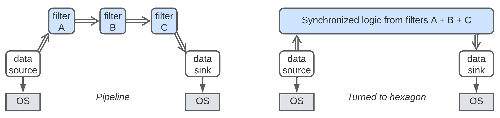

A [little more work](https://hillside.net/plop/2020/papers/poltorak.pdf) is needed to turn _domain actors_ (_Services_ – also from Part 3) into _Hexagonal Architecture_. First, each _service_ is divided into a high-level logic and low-level implementation details layers in a way similar to the one described above for turning a monolith into _Hexagonal Architecture_. Then, the upper actors that contain the business logic belonging to the individual _services_ are merged into a unified synchronous _domain model_.

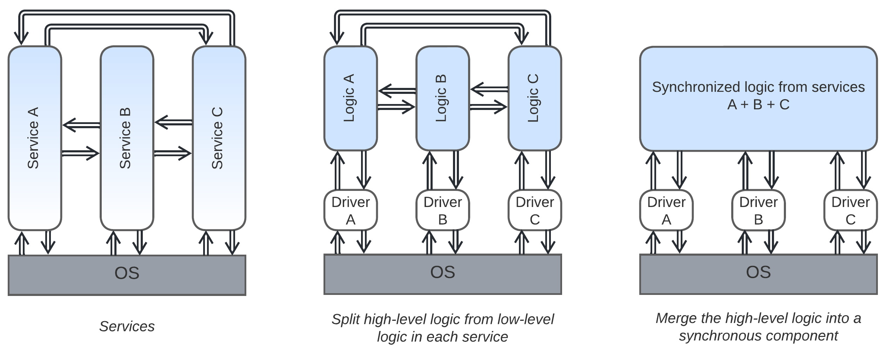

With _Hexagonal Architecture_, the business logic resides in the upper layer. It is possible to reverse this setup:

### Gateway [[MP](#MP)] (system model over domain services)

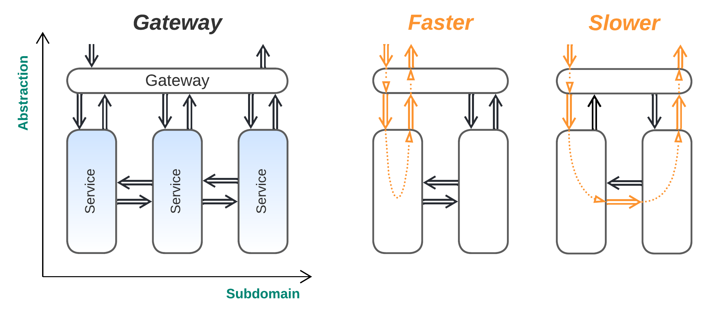

**_Isolating the system from its users_**. A thin system model layer is added over a set of services. The model encapsulates the services by providing a firewall and authentication functionality to the system, translating incoming requests to an internal data format, routing those requests to services of interest, and possibly aggregating responses from several services (_Mediator_ [[SAP](#SAP)] – see the _Orchestrators_ pattern below). This makes the system of services appear as a single service to the external world and reduces its attack surface.

_Benefits_ (in addition to those of _Services_, described in Part 3):
* The system is encapsulated by a _gateway_ that reduces the attack surface (from _Layers_).
* It is easy to support multiple client protocols, as the clients interact with a dedicated external communication module (_gateway_) that encapsulates the protocol translation and always queries the _domain_ _services_ using an internal protocol (from _Layers_).

_Drawbacks_ (in addition to those of _Services_ from Part 3):
* The _gateway_ causes some performance degradation (from _Layers_).
* The _gateway_ may be a single point of failure (from _Layers_).

_Evolution_:
* If the business logic becomes coupled, the _gateway_ may incorporate support for _orchestrators_ (see below).
* When having too many services independently developed and deployed resembles a nightmare, the services should be gathered into groups (_Cell-Based Architecture_, mentioned in Part 5), with each group encapsulated by a dedicated _gateway_.

_Summary_: A _gateway_ isolates the system from external clients in a role similar to that of an _adapter_ from _Hexagonal Architecture_, making it easy to support new client technologies and new types of clients without modifying the main business logic.

_Common names_: **Gateway**, Firewall.

_Software architecture_: Facade [[GoF](#GoF)], Proxy [[GoF](#GoF), [POSA1](#POSA1)], Dispatcher [[POSA1](#POSA1)].

_System architecture_: API Gateway [[MP](#MP)].

Both _Hexagonal Architecture_ and _Gateway_ provide an isolation of the application’s business logic from the environment. Both achieve this by adding an extra layer of indirection at the system’s boundary. They differ in the definition of the application being protected: for _Hexagonal Architecture_, the application consists of the monolithic business logic, while with _Gateway_, the whole system of services, including their databases and 3rd party components, is protected. One of the adapters in _Hexagonal Architecture_ may function as a _gateway_ to clients.

The only case remaining with the same structural diagram appears when the business logic is spread over all the modules:

### Application Service (domain model over domain services)

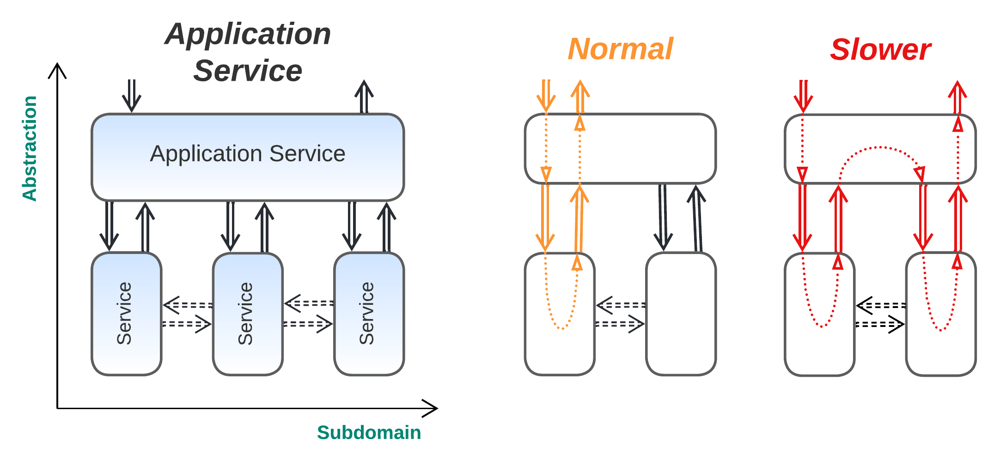

> _(The domain services may or may not communicate directly)_

**_All services are equal, but some services are more equal than others._** There is a service (_application service_) that faces most of the customer requests and coordinates other services (_domain services_) for running system-wide tasks.

_Benefits_:
* The thorough decomposition of business logic by both subdomain and level of abstraction makes the system evolvable (from both _Layers_ and _Services_).
* Coupled use cases are supported (from _Layers_).
* It is possible to scale the high-level task logic service and the subdomain services independently (from both _Layers_ and _Services_).
* In many cases, domain services are not coupled (don’t rely on each other’s interfaces), unlike those in systems without the coordinator layer.

_Drawbacks_:
* Use cases are hard to code and debug (from _Services_).
* Data may need to be synchronized among the components (from _Services_).
* The system’s responsiveness and throughput deteriorate (from _Services_).

_Evolution_:
* If the business logic becomes coupled, the _application service_ may incorporate support for _orchestrators_ (see below).
* If the _application service_ itself grows into a monolithic hell, it should either be split into _Hexagonal Hierarchy_ (implementable for hierarchical domains) or become a kind of _Cell-Based Architecture_, both mentioned in Part 5.
* If a new set of use cases appear that are representable under the current domain abstraction being used by the existing _application service,_ then a new implementation of _application service_ may be added to cover the new use cases. This efficiently turns the _Application Service_ architecture into _Service-Oriented Architecture_ (see Part 5).

_Summary_: _Application Service_ is a natural domain decomposition in cases where one subdomain supervises the other subdomains. It may greatly decouple business logic for huge projects at the cost of increasing operational and debugging complexity.

_Common names_: [Application Layer](https://herbertograca.com/2017/09/07/domain-driven-design/) [[DDD](#DDD)].

_Software architecture_: Human-Machine Interface.

_System architecture_: [Task Service Layer](https://patterns.arcitura.com/soa-patterns/basics/soamethodology/service_layers).

This structure is a basic _Hierarchy_ (that may be built up by adding more layers of services) or an underdeveloped _SOA_ (which emerges when several different _application services_ are formed). Both systems are described in Part 5 and are known to be able to mitigate domain complexity, showing the possible ways of evolving a project as it grows.

If the diagram is inverted along the _abstraction_ axis, it turns into:

## U-shaped systems

Here, the domain services have more abstract (i.e. high-level) logic than that of the model they use, which may just consist of a service transport layer, hold shared data, or be a full domain model exposing an interface for the higher layer to build upon. Again, three patterns emerge:

### Middleware (domain services over a system model)

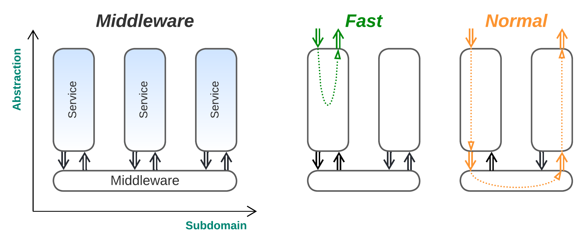

**_Sharing a transport to simplify operations. Services_** communicate via a dedicated transport layer that knows about all the system components (_Broker _[[POSA1](#POSA1), [EIP](#EIP)]) and lets them address each other (_Message Bus_ [[EIP](#EIP)]). A _middleware_ may guarantee message delivery, simplifying recovery in case of failures. It may also provide message logging, which is useful for debugging and regression testing, and may sometimes manage the _services_ by implementing recovery and scaling aspects.

_Benefits_ (in addition to those of _Services_, Part 3):
* It allows a faster start to the project, as the transport layer (possibly with such _ops_ functions as scaling and recovery) is usually available out of the box.
* The connectivity is less complex thanks to the presence of a uniform protocol and the system model (_Broker_).
* It simplifies failure recovery, as a _middleware_ usually provides message delivery guarantees and may restart failed services.

_Drawbacks_ (in addition to those of _Services_, Part 3):
* A generic _middleware_ may not provide the optimal means of communication for every connection in the system.
* _Broker_ topology may slow down messaging to some extent.
* The _broker_ may become a single point of failure.

_Evolution_:
* _Microkernel_ implementations, such as Akka or Erlang/Elixir, can be used as a _middleware_ for projects that require good scalability and fine-tuned fault tolerance.
* _Service Mesh_ (Part 5) can be used as a _middleware_ with the ability to translate between various message formats and transports.

_Summary_: _Middleware_ is very common when a relatively high number of services need to communicate – in that case, supporting communication channels between each pair of services becomes impractical. It does not add any significant architectural benefits or drawbacks to the system it serves.

_Publish-subscribe_ engines may be considered a kind of _middleware_, and they may be present even in embedded devices. A similar _middleware_ option for systems of local actors is sending messages without explicitly setting destination actors; in this case, every type of message is delivered to a dedicated global subscriber (this was also briefly mentioned in Part 1).

_Software architecture_: Middleware.

_System architecture_: (Message) **Broker** [[POSA1](#POSA1), [EIP](#EIP), [MP](#MP)], Message Bus [[EIP](#EIP)], Enterprise Service Bus (also manages services and translates payload formats).

The _message bus_ is usually excluded from architectural diagrams, as it: is very common, does not influence business logic, and does not change the system’s properties. Aside from specialized _Middleware _frameworks_,_ similar functionality is provided by decentralized _meshes_ (Part 5) and resource-sharing _microkernels_ (see below).

### Shared Repository [[POSA4](#POSA4)] (domain services over a domain _data_ model)

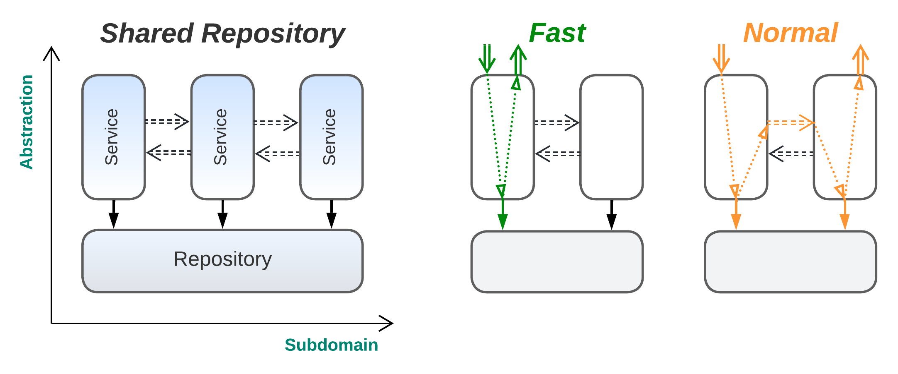

> _(The services may or may not communicate directly)_

**_Sharing the data to simplify the development._** Services are created with a shared _data layer_ (_repository_).

_Benefits_:
* The services share data, allowing for domain-wide commits without _event sourcing_ [[MP](#MP)], _views_ [[DDIA](#DDIA)] or _sagas_ [[MP](#MP)] (from _Layers_).
* The services are decoupled in deployment and some properties (from _Services_).
* The code of the services is more independent than that in vanilla _Domain Services_ systems because the _data layer_ mediates much of the communication.
* It allows a quicker start on the project than what would be possible with vanilla _Services_ (from _Layers_).
* The _data layer_ is usually available out of the box.

_Drawbacks_:
* The service implementations are still coupled via the shared _data layer_ (from _Layers_).
* The _data layer_ is likely to be hard to scale or shard (from _Layers_).
* The _data layer_ may become a single point of failure (from _Layers_).
* The shared _data layer_ implementation may not fit all the services equally well.

_Evolution_:
* As the workload and amount of stored data grows, the shared database will likely become a bottleneck. Two solutions are possible: going for vanilla _Services_ (from Part 3) that don’t share any data, or relying on a distributed _data plane_ of _Space-Based Architecture_ (mentioned in Part 5).
* The _shared repository_ may strongly couple the implementation and properties of the services that use it. Decoupling the services requires that they stop sharing data.

_Summary_: _Shared Repository_ sacrifices many of the benefits of _Services_ for a quick start on the project and the simplicity of its development. It holds its ground against _Monolith_ (Part 2) when diverse use cases require the system to manifest contradictory properties, e.g. in basic combined OLTP + OLAP applications.

Synchronous access to a _shared repository_ makes the actor system violate the actor model by sharing the state between actors. In this case, the _data layer_ should take care to resolve probable deadlocks.

_Software architecture_: **Blackboard** [[POSA1](#POSA1)], Global Data.

_System architecture_: **Shared Database**, Smart UI [[DDD](#DDD)], Shared Repository [[POSA4](#POSA4)].

Both _Shared Repository_ and _Middleware_ provide means of communication to a system of services, have similar structural diagrams, and share many benefits and drawbacks – here, once again, the correlation between a structure and its properties becomes prominent.

_Mesh_ (Part 5) provides a decentralized _middleware_ and sometimes also implements a _shared repository_ (called _Space-Based Architecture_) with physically distributed hardware.

### Plug-ins [[SAP](#SAP)] (domain services over a domain model)

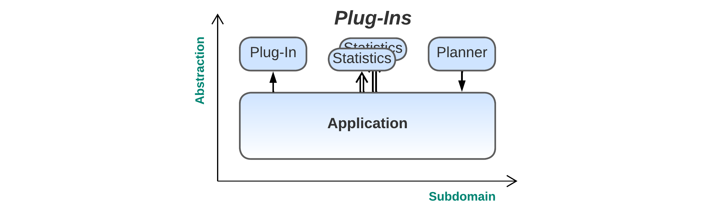

**_Supervising or fine-tuning the behavior_**. A monolithic domain model is extended with higher-level services (_plug-ins_) that collect metadata and tune or customize the model’s behavior. The _plug-ins_ may be called synchronously (i.e. looped into the model’s business logic), be notified asynchronously (e.g. collecting statistics), or query the model at will (being a controller like an AI planner, etc.).

_Benefits_:
* A very high-level logic may be written in dedicated languages or [DSL](https://en.wikipedia.org/wiki/Domain-specific_language)s (from _Layers_).
* Parts of the high-level logic are independent (in terms of development, properties, scheduling, deployment, etc.) of each other (inherited from _Services_) and of the model (inherited from _Layers_).
* The high-level logic is customizable, and different implementations may be switched in runtime or be plugged in in parallel (sharding is possible, as the _plug-ins_ don’t communicate directly).
* Event replay may be applied for debugging and testing the high-level modules in isolation.
* The main business logic supports coupled use cases (from _Layers_).
* The system tends to be fast (from _Monolith_) unless _plug-ins_ are abused.
* The complexity of the business logic is somewhat reduced by splitting high-level aspects into separate modules (from _Layers_ and _Services_).

_Drawbacks_:
* The amount of planning and development needed to support _Plug-ins_ is likely to be nontrivial. 
* _Plug-ins_ can only extend aspects of the model that were explicitly designed to be customizable.
* The _plug-ins_ tend to be independent and may have trouble intercommunicating (from _Services_).
* Use cases that involve _plug-ins_ will be slowed down (from _Layers_).
* Testability suffers greatly, as there may be many possible combinations of _plug-ins_.

_Evolution_:
* If there is a need to tune the system behavior in whole or let users write and apply custom logic, providing a _Domain-Specific Language_ (see below) should be considered.

_Summary_: _Plug-ins_ may benefit large projects that need extra flexibility or that have a nontrivial amount of very high-level business logic. However, the pattern often needs extensive support in the main code, which makes it quite hard to construct the system correctly on the first attempt. The approach is likely to be overkill for medium- and small-sized projects, while in huge projects, the domain model may well reach _monolithic hell_ [[MP](#MP)].

This is yet another case, like that of _Hexagonal Architecture_, which applies a combination of simple patterns (_Layers,_ _Services_ and _Sharding_) to yield benefits without inviting any critical flaws. While _Hexagonal Architecture_ decouples the application’s business logic from the periphery, _Plug-ins_ decouple the basic business-logic in the domain model from its high-level aspects and allow for variations in multiple aspects of the system’s behavior.

_Common names_: Metadata, Plug-ins [[SAP](#SAP)], Aspects, Hooks.

It is common to see _Plug-ins_ applied on top of _Hexagonal Architecture_’s domain model, which results in a kind of a model-in-the-middle system and combines the properties of both architectures, but the resulting architecture does not boast any special features and thus will not be reviewed separately.

## H-shaped systems

It is sometimes convenient to build a set of (often transient) _domain services_ on top of a model that provides a unified or virtualized interface to the underlying system and manages the high-level services:

### Microkernel [[POSA1](#POSA1)]

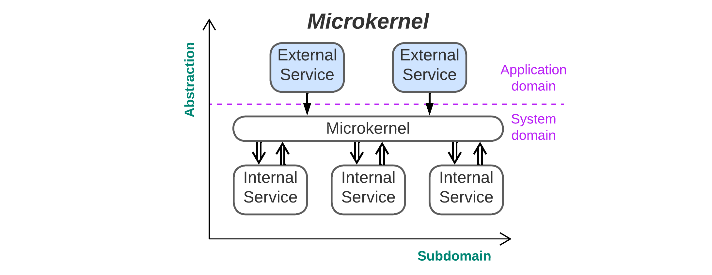

**_Sharing the system resources among hordes of services_**. A system model (_microkernel_) provides means for custom _applications_ (_external services_) to communicate and access system resources owned by _drivers_ (_internal services_). Usually, the _microkernel_ also manages the _drivers_ and _applications_, making sure that the system survives the failures of its individual components.

> _By the way, here is an example of a diagram with two domains: the business domain of the applications and the resources domain of the drivers. Both are shown along the same axis, as only two dimensions are available for diagrams._

_Benefits_:
* The system can often recover from the failures of its individual components (inherited from _Middleware_). This is enhanced by Erlang’s and Akka’s [supervisor hierarchies](https://ferd.ca/the-hitchhiker-s-guide-to-the-unexpected.html) if these frameworks are used.
* The system is foolproof in regard to the application’s (mis-)behavior.
* Applications can seamlessly migrate between environments (inherited from _Hexagonal Architecture_).
* Scalability is very good when distributed _Microkernel_ frameworks are in use.
* It is easy to replace application dependencies, in terms of both hardware and 3rd party software (from _Hexagonal Architecture_).
* The applications that run on the same system and share its resources may be independent (from _Services_).
* The deployment cycles of _applications_ and _drivers_ are completely independent  (from _Layers_).
* A faster start to application development is possible if the lower layers (_microkernel_ and _drivers_) are initially available (from _Middleware_).

_Drawbacks_:
* The infrastructure is very complex in regard to both coding and architectural decisions that must satisfy every kind of application.
* Accessing remote resources tends to be (very) slow and complex, thus making the pattern barely viable for distributed systems unless the _microkernel_ is able to move a running _application_ between servers (which is supported by Akka and Erlang).
* The _microkernel_ may be the single point of failure.
* _Microkernel_ is often implemented as a virtual machine, slowing down the running of applications.

_Evolution_:
* A distributed microkernel can be implemented with _Service Mesh_ (Part 5). However, as the implementation is very nontrivial, a 3rd party product is used in most cases.

_Summary_: _Microkernel_ architecture manages the use of limited resources by untrusted applications and provides them with connectivity, often supporting large numbers of independent or interacting actors and providing the means to build supervision hierarchies for error recovery. It originates with operating systems and is mostly limited to system software (OS, virtualization, distributed FS) because of the high infrastructure development cost and performance penalty imposed on accessing distributed goods. On the other hand, yet another custom _Microkernel_ implementation may become a framework for _SOA_ (Part 5), which is even more heavy-weight and sluggish.

_Microkernel_ may be regarded as multiple _Hexagonal Architectures_ sharing a set of _adapters_ via a common _middleware_ or as a _Middleware-Gateway_ system where the _microkernel _serves as both a _gateway_ to _drivers_ and a _middleware_ to _applications_. A distributed _Microkernel_ is related to _Mesh_ (Part 5), which also provides virtualization for system resources.

_Common names_: Runtime, User Space, Applications, Coroutines.

_Software architecture_: **Microkernel** [[POSA1](#POSA1)], Half-Sync/Half-Async [[POSA2](#POSA2)].

_System architecture_: **Containers**, Actors Framework.

Containerization software and Akka and Erlang runtimes are examples of distributed _Microkernel_ frameworks and are used out of the box for cloud applications, some of which run [millions](https://youtu.be/bo5WL5IQAd0?t=2694) of _Nanoservices_ (Part 3) with a dedicated actor instance for each user in a banking, telephony, transportation, instant messaging or online gaming network. An OS is a kind of _Microkernel_. In most cases, the _microkernel_ and everything below it is skipped in drawing architectural diagrams.

_Half-Sync/Half-Async_ [[POSA2](#POSA2)], which was first discussed in Part 2 as an implementation of _monolithic_ applications then revisited in Part 3 as a _layered_ pattern, appears, on closer inspection, to be _Microkernel_. Indeed, both patterns describe an OS with applications and drivers, the main difference being that _Half-Sync/Half-Async_ does not discern individual drivers in the OS layer. With the coroutine implementation of _Half-Sync/Half-Async_, the coroutine engine stands for the _microkernel_, async event handlers are _internal services_, and the coroutines match _external service_ components.

### Domain-Specific Language (DSL)

> _(Scripts are usually transient)_

**_Scripting and configuring the system_**. _Plug-ins_ architecture is modified by adding an intermediary layer that provides a runtime support (_interpreter_) and a kind of system model (_framework_) to the upper layer’s plugins (_scripts_), which are usually written in a high-level language. The _interpreter_ will usually manage multiple instances of different _scripts_, making the whole system quite similar to _Microkernel_ except for the nature of the services the lower layer provides; in _Microkernel_, the _applications_ use system resources, while in _DSL_, the _scripts_ manage domain objects that implement the business logic and reside in the _domain model layer_.
_Benefits_ (in addition to those of _Plug-ins_):
* _Scripts_ are usually very high-level and decoupled from the main codebase, thus requiring much less effort to write compared to similar functionalities in the _domain layer_ (from _Plug-ins_).
* _Scripts_ can seamlessly migrate between setups (from _Microkernel_).
* The system may be fool-proof against errors in _scripts_ (from _Microkernel_).

_Drawbacks_ (in addition to those of _Plug-ins_):
* It may be hard to design a good interface between the _scripts_ and the _domain model_ (from _Microkernel_).
* _Scripts_ tend to be slow unless compiled, but compiling a DSL is a nontrivial task (from _Microkernel_).

_Summary_: This is a mixture of _Plug-ins_ and _Microkernel_ that combines most of their properties. The added _interpreter_ _layer_ provides a holistic way to govern the system’s behavior as a whole, as opposed to a discrete set of aspects covered by individual _plug-ins_. While _plug-ins_ tend to be static (don’t change between the system’s deployments), _scripts_ are often short-running tasks that set up domain rules.

_Common names_: Domain-Specific Language (DSL), Scripts, Config File, Command Line Interface (CLI).

_Software architecture_: Interpreter [[GoF](#GoF)].

Prominent examples include game scripts, Blender scripts and even SQL. A very special case of a script is a config file, which is executed once on system startup. A CLI is yet another common example.

There is a variant where the lower layer consists of domain services, with an _ASS_ diagram (Part 3) similar to that of _Microkernel_. In that case, the _interpreter_ is also a _gateway_ for the _internal services_, while the _scripts_ manage the distributed system. An example would be CLI and configuration tools for distributed systems or containerization software. Such an architecture is somewhat related to:

### Orchestrators [[MP](#MP)]

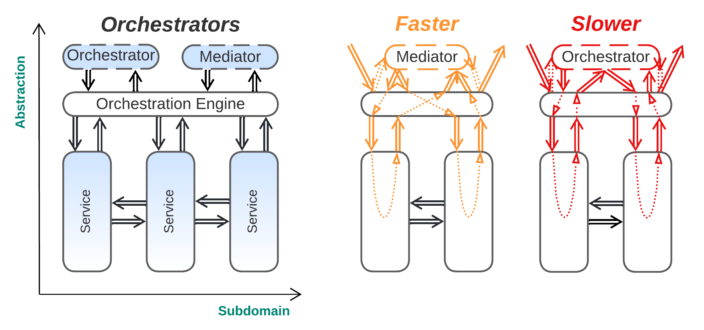

> _(Orchestrators and Mediators are transient)_

**_Distributed transactions and multi-service queries._** Multiple instances of thin domain services (_orchestrators_) are spawned by a _model layer_ (a _gateway_ with an orchestration engine or an _application layer_) over a set of _domain services_. Each _orchestrator_ drives a multi-service use case by iterating through a sequence of steps (requests to individual services). The business logic is split between the _orchestrators_ that belong to the _application layer_ of [[DDD](#DDD)] (and contain very high-level descriptions of the steps to be taken for each user scenario) and the underlying _services_ that correspond to the _domain layer_ of [[DDD](#DDD)], where all of the business rules and knowledge [reside](https://herbertograca.com/2017/09/07/domain-driven-design/). Each _orchestrator_ supervises a single use case running in the system, and thus, multiple instances of many types of _orchestrators_ are often present simultaneously.

_Benefits_:
* The highest-level logic of use cases is easy to implement and read (from _Layers_).
* Subdomain services may be very independent, as the high-level coordination logic has been moved to a separate level.
* Domain complexity is addressed, as most of the business logic is distributed between multiple services of comparable size (from _Services_).
* The system is encapsulated with a _gateway_ that reduces the attack surface (from _Gateway_).
* Multiple client types and protocols are easy to support (from _Gateway_). 
* The _subdomain services_ may be developed and deployed relatively independently (from _Services_).
* The _subdomain services_ run in parallel and are sharded mostly independently (from _Services_).
* Use cases that don’t cross subdomain borders (i.e. are limited to a single subdomain) are very fast (from _Services_).

_Drawbacks_:
* When several _orchestrators_ access the same data, it may lead to many kinds of inconsistencies or data corruption (_anomalies_ caused by the _CAP theorem_ [[MP](#MP)])  (from _Services_, but not as severe as the corresponding drawback present there).
* Use cases that involve several subdomains are relatively slow and are hard to debug (from _Services _and_ Gateway_).
* The _services_ become somewhat bound in properties to allow for efficient orchestration.
* There is moderate administration complexity for _service_ instances, as they must be registered with the _orchestrator engine_ (from _Gateway_).
* The _orchestrator engine_ (usually implemented in a _gateway_ [[MP](#MP)]) can often be a single point of failure (from _Gateway_).

_Evolution_:
* As the complexity of distributed use cases grows, a transition to _Application Service_ or _Hexagonal Architecture_ (see above) may be considered.

_Summary_: _Orchestrators_ counter the main drawback of _(Micro-)Services_ (described in Part 3), namely the trouble with use cases that involve several subdomains. They even allow for distributed transactions (_sagas_ [[MP](#MP)]). As splitting to services is the only way to counter domain complexity, _Orchestrators_ are likely to emerge in huge projects. However, they are both much more irksome than synchronous method calls in a monolith (or in the model in a _Hexagonal Architecture_) and tend to somewhat limit the independence of the _services’_ non-functional properties.

_Services with Orchestrators_ is derived from a monolith in the following steps:
1. The monolith is split into _subdomain_ _services_, escaping _monolithic hell_ [[MP](#MP)].
2. An extra layer (_gateway_) governing multi-service use cases and transactions is created to integrate the _services_.

This results in more control over whole-system scenarios compared to pure _Services_ (_Domain Actors_) without losing the benefit of addressing domain complexity. The costs are:
* Interdomain use cases are complicated and slow (compared to _Layers_), but are at least mostly manageable.
* The system is slower and more complex than it would be with the original _(Micro-)Services_ pattern.

This case contrasts with _Hexagonal Architecture_; there, the goal was to combine the benefits of the two basic patterns, whereas _Services with Orchestrators_ addresses the main penalty incurred by utilizing the only basic system structure (_Services_) that is plausible for huge projects.

_Software architecture_: Coordinator [[POSA3](#POSA3)].

_System architecture_: **Orchestrator** [[MP](#MP)], Event Mediator [[SAP](#SAP)].

Somewhat distinct types of orchestrators exist: a _saga_ _orchestrator_ [[MP](#MP)] usually drives a distributed transaction and allows for rollbacks if one of the steps fails, while an _event mediator_ [[SAP](#SAP)] tends to provide a unidirectional flow, with the added benefit of being able to run some or all of the involved steps in parallel. The multiple instances of orchestrators may be considered separate actors (for _sagas_) or may be embedded in a layer (_mediator_ / _gateway_).

## Miscellaneous architectures

There are many ways to apply several of the patterns listed together, but they only seem to combine the properties of the constituents instead of creating something new:
* _Gateway_ on top of _Hexagonal Architecture_ (actually, the _Gateway_ is yet another _adapter_)
* _Plug-ins_ or _DSL_ on top of _Hexagonal Architecture_
* _(Micro-)Services_ with _Gateway_ or _Orchestrators_ and _Middleware_, _Shared Repository_ or _Microkernel_
* _Hexagonal Services_, where _Hexagonal Architecture_ is applied to every _service_ in a system

However, there is one very special architecture unlike any other:

### [(Re)Actor-with-Extractors](http://ithare.com/multi-coring-and-non-blocking-instead-of-multi-threading-with-a-script/3/) (Day and Night)

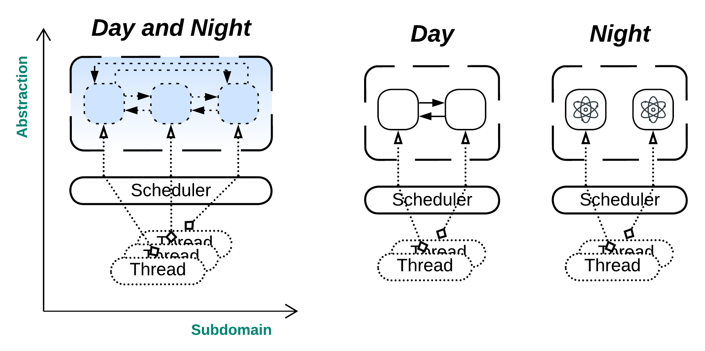

**_A lock-free shared memory interaction_**. This case comes from game development and allows for the efficient use of all the available CPU cores in systems that contain large numbers of closely interacting (accessing the data of each other), self-governed (with localized decision-making) entities. There is a _scheduler_ that uses a _thread pool_ (a thread per CPU core) to give each entity a chance to run once per _phase_. Once all the objects are served, the _phase_ is toggled. There are two kinds of _phases_:
* Read phase (_Day_ or _Extract_): All the objects are read-only, thus allowing all their data and methods to be accessed without locking. The objects that are running call methods or read data from other objects they are interested in so as to read and store the data they need as input for their planning of future actions.
* Write phase (_Night_ or _Process_): Every object calculates and writes its next state based on the input it has collected during the _day_ phase. The objects do not interact; thus, they behave like actors, each processing a single message it posted to itself during the _day_ phase.

This approach unites the shared memory (objects) and actors paradigms by leading the entire system through repeated _extract_ (shared memory) and _process_ (message passing) phases.

I see the next possible variants:
* The planning may be done during the _day_ phase, with the planning result stored in the object’s message queue and the _night_ phase amounting to the act of applying the previously calculated state updates.
* In the _day_ phase, objects may post messages to each other. During the _night_ phase, they will process all those messages till their queues are empty.

## Summary

This part discussed the following kinds of systems that feature monolithic layers:
* Π-shaped systems, where the common layer unites and uses the underlying services.
* U-shaped systems, where the shared layer connects and supplies a shared workspace for the high-level services.
* H-shaped systems, where the layer virtualizes the underlying system for the topmost services.

Many names for mostly identical structures were mentioned. [The Rule of Three](https://wiki.c2.com/?ThingsInThrees) was observed thrice.

The next (and final) part is dedicated to fragmented architectures that contain no single module that spreads over the entire system.

## References

<a name="DDD"/>

[DDD] Domain-Driven Design: Tackling Complexity in the Heart of Software. _Eric Evans. Addison-Wesley (2003)._

<a name="DDIA"/>

[DDIA] Designing Data-Intensive Applications: The Big Ideas Behind Reliable, Scalable, and Maintainable Systems. _Martin Kleppmann. O’Reilly Media, Inc. (2017)._

<a name="EIP"/>

[EIP] Enterprise Integration Patterns. _Gregor Hohpe and Bobby Woolf. Addison-Wesley (2003)._

<a name="GoF"/>

[GoF] Design Patterns: Elements of Reusable Object-Oriented Software. _Erich Gamma, Richard Helm, Ralph Johnson, and John Vlissides. Addison-Wesley (1994)._

<a name="MP"/>

[MP] Microservices Patterns: With Examples in Java. _Chris Richardson. Manning Publications (2018)_.

<a name="POSA1"/>

[POSA1] Pattern-Oriented Software Architecture Volume 1: A System of Patterns. _Frank Buschmann, Regine Meunier, Hans Rohnert, Peter Sommerlad and Michael Stal. John Wiley & Sons, Inc. (1996)._

<a name="POSA2"/>

[POSA2] Pattern-Oriented Software Architecture Volume 2: Patterns for Concurrent and Networked Objects. _Douglas C. Schmidt, Michael Stal, Hans Rohnert, Frank Buschmann. John Wiley & Sons, Inc. (2000)._

<a name="POSA3"/>

[POSA3] Pattern-Oriented Software Architecture Volume 3: Patterns for Resource Management. _Michael Kircher, Prashant Jain. John Wiley & Sons, Inc. (2004)._

<a name="POSA4"/>

[POSA4] Pattern-Oriented Software Architecture Volume 4: A Pattern Language for Distributed Computing. _Frank Buschmann, Kevlin Henney, Douglas C. Schmidt. John Wiley & Sons, Ltd. (2007)._

<a name="SAP"/>

[SAP] Software Architecture Patterns. _Mark Richards. O’Reilly Media, Inc. (2015)._

---

_Editor:_ [Josh Kaplan](mailto:joshkaplan66@gmail.com)

_[Part](../README.md)_ 1 2 3 **4** 5

---

 This work is licensed under a <a rel="license" href="http://creativecommons.org/licenses/by-nc-sa/4.0/">Creative Commons Attribution-NonCommercial-ShareAlike 4.0 International License</a>.