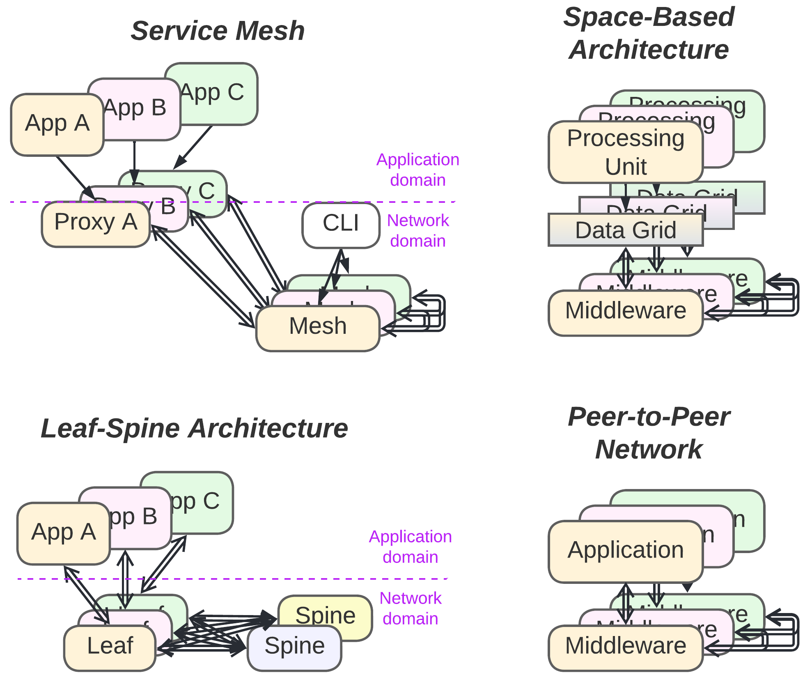
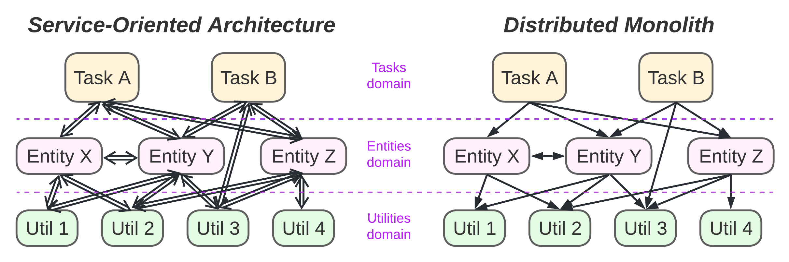
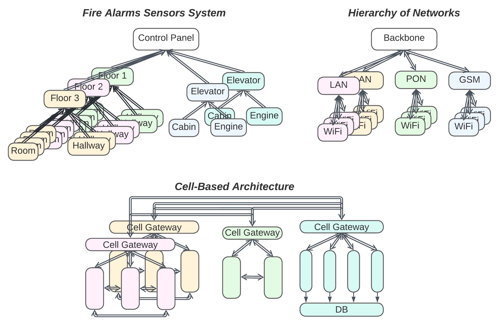
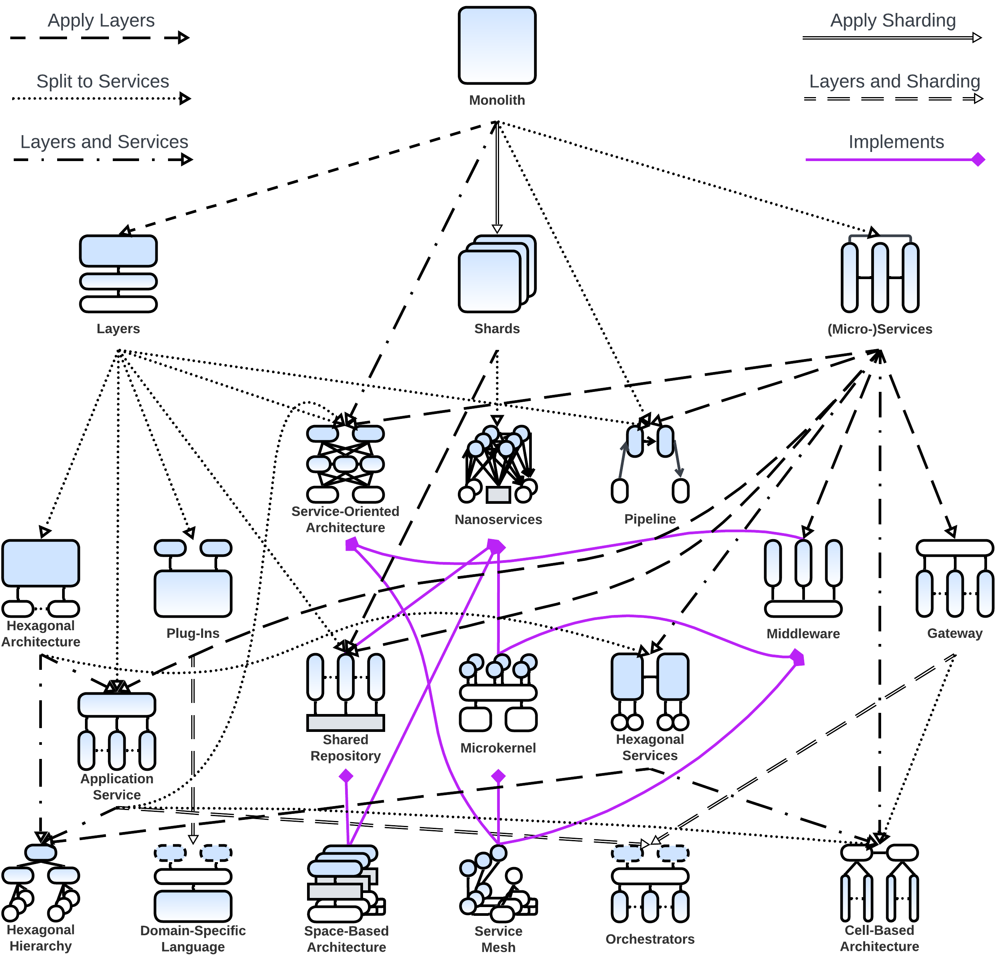

_[Part](../README.md)_ [1][Part 1] [2][Part 2] [3][Part 3] [4][Part 4] **5**

---

# Introduction to Software Architecture with Actors: Part 5 – On Fragmented Systems

The [previous part][Part 4] of this cycle was dedicated to systems with _models_, i.e. horizontal layers that spread through an entire domain. If a structural diagram for a system is drawn with abstraction increasing upwards, the model may be found above services (resulting in a Π-shaped system), below them (U-shaped) or in the middle (H-shaped). For each type of system structure, a set of three distinct patterns emerges through variations in the distribution of the business logic over the components.

The [preceding article][Part 3] described the three basic ways to divide a monolith, namely: sharding (spawning identical instances), layers (splitting by abstraction) and services (splitting by subdomain).

Now, according to the _[Rule-of-Three](https://en.wikipedia.org/wiki/Planescape#Rule-of-Three)_, there should be three kinds of fragmented architectures with neither monolithic layers (models) nor non-layered subdomains.

- [Mesh](#mesh)
  - [Service Mesh](#service-mesh)
  - [Leaf-Spine Architecture](#leaf-spine-architecture)
  - [Peer-to-Peer Network](#peer-to-peer-network)
  - [Space-Based Architecture [SAP]](#space-based-architecture-sap)
- [Distributed Modules (SOA)](#distributed-modules-soa)
- [Hierarchy](#hierarchy)
  - [Hexagon of Hexagons (Hexagonal Hierarchy)](#hexagon-of-hexagons-hexagonal-hierarchy)
  - [Bus of Buses (Hierarchy of Networks)](#bus-of-buses-hierarchy-of-networks)
  - [Services of Services (Cell-Based Architecture)](#services-of-services-cell-based-architecture)
- [Design Space](#design-space)
- [Summary](#summary)
- [The Pattern Language](#the-pattern-language)
- [References](#references)

## Mesh

Cutting a monolith along all the axes under discussion (_abstraction_, _subdomain_, _sharding_ – see [Part 3]) simultaneously does not make much sense, as the resulting structure is too hard to manage, that is, unless it relies on communication between shards to form a _mesh_.

**_A customizable distributed middleware for unreliable networks_**. The lower layer of services implements network connectivity, while the upper services contain the business logic. Two domains, namely, _application_ and _network_, are present.

The _network_ domain may supply _proxies_ that virtualize network resources for the _applications_, but is generally built around _mesh_ shards that sustain network topology and are usually managed via a global _configurator_. _Proxies_ and _mesh_ _actors_ have different properties; the _proxies_ provide a convenient connectivity and cached resource abstraction to the _applications_, which usually includes (some of) the: blocking calls, retries, virtual connection objects and _data grid_, while _mesh_ is occupied with a great deal of the low-level, and often hardware-dependent, real-time communication. 

The other domain is the _application_ level, where different kinds of business _applications_ run on top of and communicate through identical or similar (as application protocols may vary in _Service Mesh_) _proxy_ interfaces. The entire _network_ layer serves as a distributed _middleware_ (described in [Part 4]), with some implementations also providing a _shared repository_ (also from [Part 4]).

In this type of system, all the components have specific roles and are usually developed and deployed independently. This explains the granularity observed in the structure. However, from the viewpoint of business logic, it is mostly similar to a system of _services_ or _shards_ (both described in [Part 3]) that make up the application level; thus, the entire network layer tends to be excluded from architectural discussions once implemented or purchased.

_Benefits_ (in addition to those of _Services_, [Part 3]):
* The system tolerates the loss of any component thanks to its decentralization and redundancy; this way, it can run on commodity hardware or even use the leftovers of CPU time at volunteers’ desktops worldwide.
* The extra layer of _proxies_ allows for abstracting distributed resources, e.g. providing a virtual view of physically distributed data in _Space-Based Architecture_ and torrents.
* Perfect scalability is achieved.
* The unified transport interface simplifies development.

_Drawbacks_ (in addition to those of _Services_, [Part 3]):
* Scenarios that involve multiple _applications_ may be tremendously hard to debug due to unstable failures at the network level.
* Scenarios that involve multiple _applications_ may be unstable if _Mesh_ is run over an unreliable network or low-end hardware; therefore, shards of a single _application_ type must be interchangeable (either stateless or with replicated data) to provide redundant service capacity.
* There is a high communication overhead that causes delays in messaging and slows down access to distributed resources for systems not limited to a single data center.
* Use cases may need to retry on failures at any step and tolerate lost or duplicated messages, cases of multiple diverging responses to a single request included.
* The transport layer is complex; thus, an out-of-the-box product should be used wherever possible.
* The unified transport interface may be non-optimal for some use cases.

_Summary_: _Mesh_ provides a shared virtual space over unreliable networks, often at the expense of communication speed and stable participants’ identities.

_Common names_: Peer-to-peer / Ad-hoc Networks.

_System architecture_: **[Service Mesh](https://buoyant.io/service-mesh-manifesto)**, Space-Based Architecture [[SAP](#SAP)].

Real-world applications of _Mesh_ architectures include data center infrastructure, torrents and even [finances](https://jimmysongio.medium.com/introducing-sofamesh-a-solution-for-large-scale-service-mesh-based-on-istio-by-ant-financial-84ff51fd66f6). Like _Middleware_ and _Microkernel_ (both described in [Part 4]), _Mesh_ is also usually dropped from architectural diagrams, as it is transparent for business logic.

There are many variants of meshes designed for different uses. I will provide short descriptions for some of the ones that I find interesting:

### [Service Mesh](https://buoyant.io/service-mesh-manifesto)

Proxies may contain application-specific code that handles protocol format conversions (e.g. JSON &lt;-> XML &lt;-> Protobuf) and implements aspects (security, observability). This provides an extra layer of indirection, with independent development and deployment, between the business logic and the network implementation.

_Service Mesh_ frameworks are usually purchased to kickstart projects that implement _Microservices_ ([Part 3]) or to merge systems that have been developed independently.

### [Leaf-Spine Architecture](https://www.geeksforgeeks.org/spine-leaf-architecture/)

This is a two-layer _full mesh_ (where every device in one layer is directly connected to _all_ of the devices in the other layer) for use inside data centers. The full connectivity approach both guarantees that the failure of any one device will not impair the network speed for other components and provides a high data transfer rate with commodity hardware. However, the size of the mesh is limited by the number of physical ports in the network switches used, and wiring the thing involves hundreds or thousands of network cables.

_Leaf-Spine Architecture_ provides fast, cheap and stable connectivity between servers within data centers of moderate size.

### Peer-to-Peer Network

Here, all the _nodes_ are equal and able to find each other. Moreover, _proxy_ and _mesh_ components are merged together to optimize the single task the _P2P Network_ is specialized in.

_P2P Networks_ are used for fault tolerant communication and data exchange (torrent, onion, bitcoin).

### Space-Based Architecture [[SAP](#SAP)]

This pattern seems to be a _P2P Network_ featuring a _data grid_ – a virtualized _shared repository_ (from [Part 4]) that provides every node’s _application_ with access to the entire project’s data, which is distributed and replicated over multiple shards. It works like the OS’s swap files; if the _application_ (called the _processing unit_) needs to access a piece of data that is not available in the node’s RAM, the proxy (_data grid_) blocks the _application_ and sends a request to its peers to get a copy (and possibly ownership) of the data. As soon as the data has been delivered and unpacked to the node’s RAM, the waiting _processing unit_ thread is notified and proceeds as if the data originally belonged to the node. The _data grid_ tracks ownership for data segments (to avoid write conflicts) and takes care of replication and persistence (to provide parallel read access and avoid data loss). It is also likely to contain some logic that assigns user requests to nodes which already have the required data in RAM (improving temporary data access locality).

_Space-Based Architecture_ can be used for projects that work with huge datasets and are deployed over multiple data centers if the actions that run on the dataset are local (i.e. do not require reading through or transforming much of the dataset).

Here, once again, a family of related distributed implementations (_Meshes_) targets two architectural patterns (namely, _Middleware_ and _Shared Repository_, both described in [Part 4]) that have similar structural diagrams, proving that a pattern’s structure defines its properties and thus its relations to other architectures.

## Distributed Modules (SOA)

The preceding structure (_Mesh_) had deep sharding, explicit layers (application, proxy, connectivity) and subdomains (application support and network topology), and few component types. If those restrictions are lifted, the [chaos](http://www.soa-manifesto.org/default.html) emerges:

**_Sacrificing everything for modularity_**. If the modules of a _monolith_ ([Part 2]) are distributed over a network, the result is, surprisingly, a _distributed monolith_ [[MP](#MP)] for synchronous RPC calls or a _service-oriented architecture_ (_SOA_) for asynchronous communication.

The diagrams omit a unified _middleware_ (_Enterprise Service Bus_) that connects and manages the _services_. 

_Benefits_:
* The strongest possible reduction in _dev_ (module code) complexity (see [Part 1]) is obtained through the division of the business logic along both the _abstraction_ and _subdomain_ axes (refer to [Part 3] for the system of coordinates analyzed).
* Each module may run on a dedicated hardware that is suitable to its needs.
* _Asynchronous_ systems are able to survive the failures of individual modules.
* The modules are sharded and deployed independently.

_Drawbacks_:
* _Ops_ (module integration) complexity is high, as the modules depend on each other’s interfaces and contracts.
* The interdependencies of the modules cause interdependencies among the teams that develop those modules.
* With _synchronous_ communication, a single failed low-level module may halt the entire system.
* All the use cases are slow because too much messaging is involved.
* All the use cases are nearly impossible to debug because of the number of distributed components involved.

_Evolution_:
* If the integration complexity hits hard or the performance suffers from having too much distributed communication, merging the services into coarse-grained components should be considered. The options include _Monolith_ ([Part 2]) or _Layers_ ([Part 3]) for smaller projects (a tremendously rare case with _SOA_) and _(Micro-)Services_ ([Part 3]), probably involving _Orchestrators_ ([Part 4]), for large systems.
* If there is a need to integrate modules that use non-standard transports, a _service mesh_ (described above) may be considered for use as a _middleware_ (traditionally called an _Enterprise Service Bus_ in SOA).

_Summary_: _SOA_ decreases the individual modules’ code complexity without introducing any code or data duplication among the modules at the cost of incurring overwhelming integration complexity and interdependency.

_System architecture_: **[Service Oriented Architecture](https://patterns.arcitura.com/soa-patterns/basics/soamethodology/service_layers)**,Distributed Monolith (synchronous RPC calls) [[MP](#MP)].

This approach should have worked in an ideal world with perfect interteam communication and zero-cost distributability. Nevertheless, the method survived, mostly in automotive, avionics and legacy enterprises (that had put lots of resources into implementing _SOA_ while it was considered a brave new fashion).

Why is _SOA_ still thriving in vehicle engineering? Probably because it allows the services to be dispersed over cheap, spatially distributed chips. If there are already physical black boxes being used for logging – why not use them as system-wide logger components? A brake chip placed near a wheel does not log anything to its own flash – it sends all the logs to a remote black box. And even if the black box fails, the brake will still be functional. The reliability of the CAN bus compared to that of the Internet could also have influenced the choices made in the industry, and the same could be said of the inherent modularity of car internals, which resembles the OOP principles _SOA_ was based on. Moreover, design committees in automotive, avionics and enterprise industries could well be banning any innovation for ages. Huge codebases in these domains should have been yet another driving force towards favoring _SOA_ architectures.

Why did _SOA_ go extinct in other kinds of backends? Because _Microservices_ (detailed in [Part 3]) are way more independent in their development, deployment and production. This means less struggling with _ops_ (i.e. deployment and integration), less inter-team synchronization, minimal downtime and better performance. It is true that with _Microservices_, the code is less granular and sometimes duplicated, but the idea of reaching high granularity was the mistake discussed in [Part 1]; any attempts to distribute a coupled logic or cut it with asynchronous interfaces result in slow, unstable, and unsupportable systems that are hard to understand and nearly impossible to debug.

## Hierarchy

The last pattern to be discussed is more of an approach than a well-defined composition of modules.

**_Using recursive modularity and polymorphism to curb complexity_**. A pattern is applied recursively, often resulting in a tree-like structure with a relatively small amount of very high-level logic managing multiple, in many cases polymorphic, modules of an intermediate abstraction level, each of which supervises a set of concrete services or devices.

_Benefits_:
* The domain logic is divided into multiple, relatively small parts.
* The development, deployment, scaling and properties of the involved modules are mostly independent.
* The system is fault tolerant for any but the topmost component.
* The subsystems may serve many use cases without escalating them to the highest level.
* Local use cases tend to be fast and run in parallel.
* Both bottom-level components and entire subsystems are easily replaceable or stubbable thanks to the abundance of layers and the common use of polymorphism.

_Drawbacks_:
* The pattern is not applicable to domains that are not inherently hierarchical.
* The topmost layer may become a bottleneck for performance, stability or evolvability.
* The failure of the topmost component will halt global use cases. However, it will not influence local tasks handled by the subsystems.
* Global use cases, which spread over multiple layers, are rather slow and hard to debug.
* The start of the project may be on the slow side because many interfaces need to be settled.

_Summary_: _Hierarchy_ brings many significant benefits wherever it can be used.

_Common names_: Hierarchy, Tree, Recursive Structure.

_Software architecture_: Presentation-Abstraction-Control [[POSA1](#POSA1)].

_System architecture_: **[Cell-Based Architecture](https://trmidboe.medium.com/cell-based-architecture-and-federated-microservices-4fc0cf3df5a6)**.

Hierarchy handles domain complexity by efficiently distributing it over multiple layers of services. If the main drawback of _Hexagonal Architecture_ ([Part 4]) lies in its monolithic business logic layer, hierarchical _Hexagon of Hexagons_ divides the business logic along both the _abstraction_ and _subdomain_ design dimensions. If the _Message Bus_ ([Part 4] – _Middleware_) logic becomes too complex, _Bus of Buses_ can come to the rescue. When there are too many _(Micro-)Services_ ([Part 3]) to integrate and deploy efficiently, _Services of Services_ is the answer.

If a system looks like it can be partitioned into groups or into a coordinating component and several (preferably polymorphic) coordinated components of comparable size, it calls for the application of the _hierarchy_ approach. If there is no coordinator, the system resembles _Services_ (from [Part 3] of this cycle). And if the coordinator seems to incorporate the largest share of the business logic, the system shifts towards Π-shaped _Hexagonal Architecture_ or _Application Service_ structures (both from [Part 4]).

The variants I am aware of include:

### Hexagon of Hexagons (Hexagonal Hierarchy)

The business logic of each layer operates a set of lower-level entities, each containing its own business logic. This way, the _adapters_ of the topmost _hexagonal architecture_ ([Part 4]) become _models_ of the lower layer. In its simplest composition, the structure is similar to _Application Service_ ([Part 4]) with hexagonal components.

Such structures emerge in industrial IoT (e.g. fire alarm) systems; the upper layer is a control desk with a UI, while below it reside distributed floor and elevator controllers that integrate data from individual sensors in their respective zones of control. Such multi-layer, multi-component systems are flexible enough to be easily re-configured for various kinds of buildings or updated with new sensor models.

### Bus of Buses (Hierarchy of Networks)

When there is a need to interconnect multiple types of networks (or _Message Buses_ – [Part 4]), it is usually done via a single master network. Each of the lower-level networks implements a gateway, adapter or router that translates between the higher-level and lower-level networks’ protocols.

The most well-known example is the Internet or telephony networks. In the desktop world, there was the _Presentation-Abstraction-Control_ [[POSA1](#POSA1)] pattern, which is [likely dead by now](https://herbertograca.com/2017/08/17/mvc-and-its-variants/). It used a tree of agents (i.e. actors subscribed for external events) to present hierarchical structures with component-specific UI widgets.

### Services of Services ([Cell-Based Architecture](https://trmidboe.medium.com/cell-based-architecture-and-federated-microservices-4fc0cf3df5a6))

Having too many same-level _microservices_ ([Part 3]) complicates integration (including tracking service dependencies) and deployment. The proposed solution clusterizes the system into comparatively strongly coupled groups. Each group gets a _gateway_ ([Part 4]), is deployed as a whole and is treated by the other groups as a single _microservice_, notwithstanding its fragmented internal structure. This results in the deployment and integration complexity being based on the number of groups, not the number of individual _microservices_.

This structure may incorporate elements of _Hexagonal Architecture_ and _Orchestrators_ (both from [Part 4]). _Application Services_ ([Part 4]) that feature high-level business logic may be used instead of _Gateways_ if the domain allows for a partially hierarchical decomposition.

## Design Space

The _design space_ [[POSA1](#POSA1), [POSA5](#POSA5)] is an [imaginary](https://youtu.be/AnaQXJmpwM4?t=22) multidimensional set that contains all the possible architectures for all kinds of systems. It is multidimensional because every architecture has multiple parameters that may be changed, each parameter serving as a dimension of the solution space.

However, humans have a hard time dealing with more than three dimensions. Therefore, we need a projection in order to confine our efforts to a couple of design aspects. This is exactly what has been done over the last 3 parts of this cycle with the **_ASS_** (_Abstraction, Subdomain, Sharding_) structural diagrams.

I hope that all (or at least 95% of) the possible elementary system structures in _ASS_ coordinates have been described and analyzed. This means that _any_ reasonable software or system architecture should map to one of the patterns reviewed or a combination thereof when projected from the _design space_ onto the _ASS_ coordinate system. Yes, most of the synchronous monoliths will look similar, since _ASS_ turns monoliths into dumb rectangles. Nevertheless, projecting a distributed system should reveal the structure that defines many of the system’s architectural properties.

## Summary

Most of the architectural patterns described in Parts 3 through 5 mix layers and services to balance and reconcile various aspects of _dev_ (module code) and _ops_ (integration of modules) complexities (see [Part 1] for the definitions).

* _Layers_ have low _integration_ complexity (lacking separate distributed parts) but often feature a coupled and possibly complex domain logic. They are easy to start developing and to debug, but tend to become complicated and fragile as the project grows.
* _Services_ have lower _code_ complexity, as each single service covers a part of the application domain, but suffer in system-wide use cases due to the fact that they are hard to coordinate. It’s a kind of flexible and evolvable solution that’s very easy to get wrong for complex or coupled domains.

It is important to find and apply a set of structures that fits the project’s needs. There are some simple rules:

_It is good_ to keep a coupled logic in a single component. \
_It is bad_ to spread a coupled logic over multiple components, especially if the components are asynchronous or distributed.

_It is good_ to keep parts that vary in non-functional requirements (“-ilities” [[MP](#MP)]) apart in separate, asynchronous entities (actors or services). \
_It is bad_ to try to satisfy incompatible non-functional requirements with a single component.

_It is not always possible_ to follow such simple pieces of advice. Nevertheless, it is usually better to know them beforehand. \
_It is possible_ to change the architecture during a project’s lifetime. However, it is easier said than done.

There is a paradox that the most important decisions must be made at the early stages of projects, precisely when the amount of information available is at its minimum. Software architecture tries to alleviate this trouble by providing means to delay the decisions involved; some patterns, e.g. _Hexagonal Architecture_ ([Part 4]), keep the business logic protected from the implementation details, delaying the selection of third-party tools till their suitability to the project’s needs has been well tested. In other cases, it is possible to [start with a monolithic application](https://martinfowler.com/bliki/MonolithFirst.html) and delay its division into services till the project has outgrown its initial architecture. Thus, it makes sense to know in advance which architectural transitions are available.

## The Pattern Language

The patterns revisited in this series form a pattern system [[POSA1](#POSA1)] – a classification of architectural patterns, in our case – according to their structure in _ASS_ coordinates ([Part 3]). However, people love pattern languages [[POSA2](#POSA2)]; thus, there is a need to show how the architectural patterns are connected and how the architectures may be transformed under various forces. It should be noted that most of the transformations are reversible should forces change, e.g. eagerly escaping a monolithic hell may lead straight into a distributed transactions nightmare or an [interactions inferno](https://www.doit.com/untangling-microservices-or-balancing-complexity-in-distributed-systems/).

The diagram only plots the main transitions between architectural patterns and is too complex to show the forces behind the pattern evolutions. Thus, the reader is advised to check the “Evolution” sections in the pattern descriptions in this series to get the full explanation.

## References

<a name="DDIA"/>

[DDIA] Designing Data-Intensive Applications: The Big Ideas Behind Reliable, Scalable, and Maintainable Systems. _Martin Kleppmann. O’Reilly Media, Inc. (2017)._

<a name="MP"/>

[MP] Microservices Patterns: With Examples in Java. _Chris Richardson. Manning Publications (2018)_.

<a name="POSA1"/>

[POSA1] Pattern-Oriented Software Architecture Volume 1: A System of Patterns. _Frank Buschmann, Regine Meunier, Hans Rohnert, Peter Sommerlad and Michael Stal. John Wiley & Sons, Inc. (1996)._

<a name="POSA2"/>

[POSA2] Pattern-Oriented Software Architecture Volume 2: Patterns for Concurrent and Networked Objects. _Douglas C. Schmidt, Michael Stal, Hans Rohnert, Frank Buschmann. John Wiley & Sons, Inc. (2000)._

<a name="POSA5"/>

[POSA5] Pattern Oriented Software Architecture Volume 5: On Patterns and Pattern Languages. _Frank Buschmann, Kevlin Henney, Douglas C. Schmidt. John Wiley & Sons, Ltd. (2007)._

<a name="SAP"/>

[SAP] Software Architecture Patterns. _Mark Richards. O’Reilly Media, Inc. (2015)._

---

_Editor:_ [Josh Kaplan](mailto:joshkaplan66@gmail.com)

_[Part](../README.md)_ [1][Part 1] [2][Part 2] [3][Part 3] [4][Part 4] **5**

---

 This work is licensed under a <a rel="license" href="http://creativecommons.org/licenses/by-nc-sa/4.0/">Creative Commons Attribution-NonCommercial-ShareAlike 4.0 International License</a>.

[Part 1]: ../Part1/README.md
[Part 2]: ../Part2/README.md
[Part 3]: ../Part3/README.md
[Part 4]: ../Part4/README.md